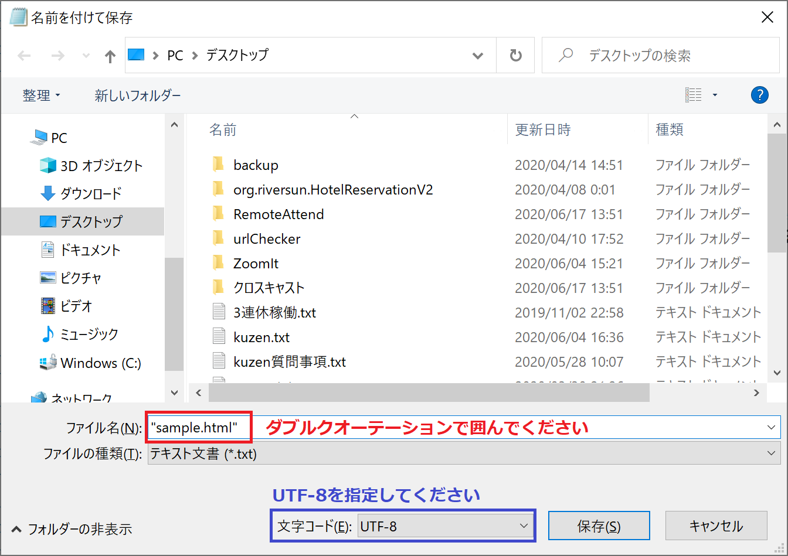
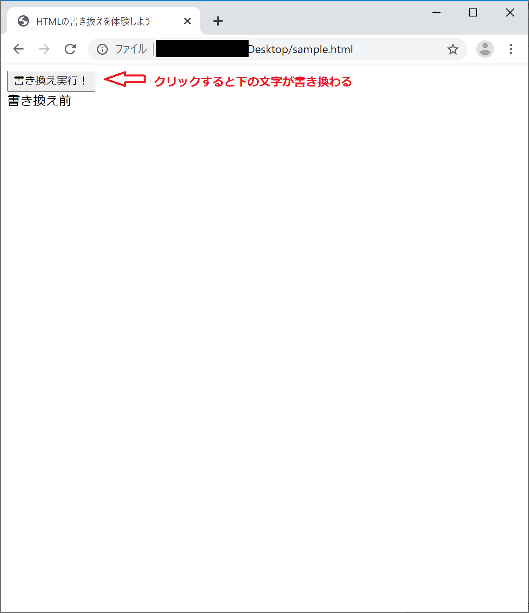
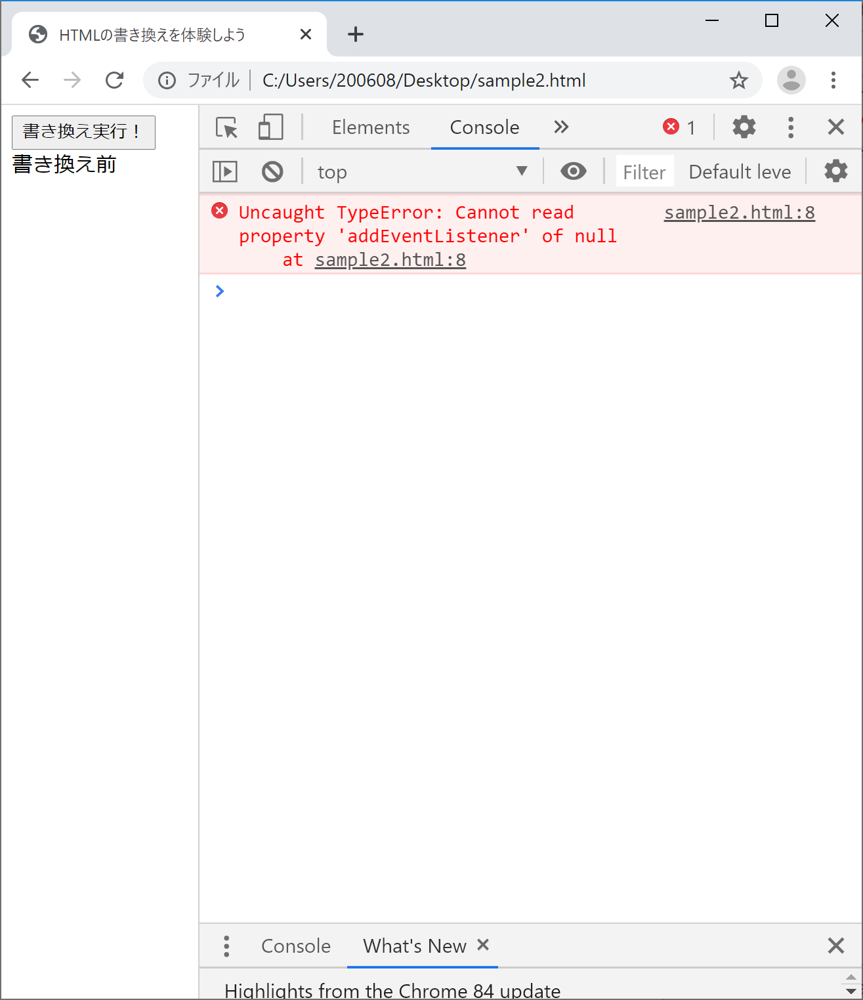

## HTMLと組み合わせて使ってみよう
ついに最後の章です。

受け取ったデータをJavaScriptで処理してHTMLを書き換えます。

### まずはHTMLの書き換えを練習してみよう
なるべくシンプルなサンプルでHTMLの書き換えを行ってみます。

メモ帳を開いて以下のHTMLを打ち込んでみてください。
ファイル名は「"sample.html"」という形でダブルクオーテーションで囲って保存してください。


※ダブルクオーテーションで囲むと勝手に「.txt」といった拡張子が付けられてしまうことを防げます。



```
<!DOCTYPE html>
<html lang="ja">
<head>
  <meta charset="utf-8">
  <title>HTMLの書き換えを体験しよう</title>

  <script>
    document.addEventListener("DOMContentLoaded",function(){
      document.querySelector("#sample_button").addEventListener("click",function(){
        document.querySelector("#result").innerHTML = "書き換えたよ！";
      })      
    })
  </script>

</head>

<body>
<button id="sample_button">書き換え実行！</button>
<div id="result">書き換え前</div>

</body>
</html>
```

保存できたらブラウザで開いて動作を確認してみてください。



#### 処理の内容を理解する
さて、とりあえずHTMLの書き換えについて動きを見ることができました。

次は処理の内容を理解しましょう。

ここのでポイントは「addEventListener」という部分です。

具体的な動きを元にざっくり説明をしてみます。

「addEventListener」の書式は以下のような形になります。

```
アクションを埋め込む対象.addEventListener("イベント名",function(){
    処理の内容
})
```

これを無理やり日本語に翻訳すると以下のような感じになります。
- アクションを埋め込む対象で
- イベント名に設定したイベントが起きたら
- 処理の内容を実行する


上記を元に読み解いてみましょう。

#### document.querySelector("#sample_button").addEventListenerの部分について

説明の順番として分かりやすくなるという理由で、
document.querySelector("#sample_button").addEventListenerの部分から見ていきます。

```
document.querySelector("#sample_button").addEventListener("click",function(){
    document.querySelector("#result").innerHTML = "書き換えたよ！";
})
```

documentは何かというと、ブラウザで表示したWebページ全体のことだと思ってください。

次にquerySelector()はHTMLの中に埋め込まれたidやclassという情報を読み込むための機能です。
()の中にCSSセレクタという書式でidやclassの名前を入れることで情報にアクセスできます。
idの場合は「#id名」、classの場合は「.class名」と入力します。

HTMLを読んでもらうとbuttonタグに「sample_button」というidがついているのが分かると思います。
従ってここではquerySelector("#sample_button")と指定することで、このボタンを指定しています。

イベント名には「click」が設定されています。


従ってここまでの範囲を日本語にすると以下の内容になります。
- ブラウザで読み込んだWebページの中のsample_buttonというidが付けられた部分で
- クリックが行われたら
- 処理の内容を実行してください


続いて処理の中身です。

処理の中身にもdocument.querySelector()が使われていますね。

ここでは「result」というidが指定されています。

そのあとにinnerHTMLというのがついています。
これは「<タグ名>文字列</タグ名>」の文字列部分を表しています。

そこに「=」をつけて新しい値として「"書き換えたよ！"」という文字列を入れています。

日本語にすると以下です。
- ブラウザで読み込んだWebページの中のresultというidが付けられた部分で
- タグの中に入っている文字列を
- "書き換えたよ！"にする


2つの説明を繋げると以下となります。
- - ブラウザで読み込んだWebページの中のsample_buttonというidが付けられた部分で
- クリックが行われたら
- ブラウザで読み込んだWebページの中のresultというidが付けられた部分で
- タグの中に入っている文字列を
- "書き換えたよ！"にする


#### document.addEventListenerの部分について
すでに実現したい内容がプログラム書かれているので、この部分は何のためにあるんだろう？と疑問に思ったかもしれません。

それを理解するためにまずはdocument.addEventListenerの部分を抜きにしたHTMLを開いてみましょう。

ファイル名は「"sample2.html"」にして、UTF-8で保存してください。


```
<!DOCTYPE html>
<html lang="ja">
<head>
  <meta charset="utf-8">
  <title>HTMLの書き換えを体験しよう</title>

  <script>
    document.querySelector("#sample_button").addEventListener("click",function(){
      document.querySelector("#result").innerHTML = "書き換えたよ！";
    })      
  </script>

</head>

<body>
<button id="sample_button">書き換え実行！</button>
<div id="result">書き換え前</div>

</body>
</html>
```

保存で来たらブラウザで開いてF12を押してみてください。
コンソール画面に8行目でエラーが表示されていると思います。




なぜこれが起きるのかを理解するには順次処理を思い出してもらう必要があります。

順次処理の章でJavaScriptは基本的にはプログラムが書かれた順番に上から実行されるというお話をしました。

これはJavaScriptだけでなく他のプログラムやHTMLでも同じです。

このサンプルではHTMLのbuttonタグは16行目に書かれています。

従って8行目で「document.querySelector(#sample_button)」が実行された時点では、「#sample_button」が設定されたボタンはまだ生成されていないのです。

存在しないボタンに対してクリックした時の動作を設定しようとしたため、エラーが起きてしまったということになります。


この現象を回避するために使っているのが「document.addEventListener」の部分になります。

それではコードの内容を見てみましょう。

```
document.addEventListener("DOMContentLoaded",function(){
    処理内容
})
```

さきほども書いたようにdocumentはブラウザで読み込んだWebページそのものです。

イベント名に設定されている「DOMContentLoaded」はざっくりいうとHTM
Lの読み込みが終わったらという感じです。
※厳密に知りたい方は「DOM」で検索してみてください。

従って日本語にすると以下のようになります。
- ブラウザで読み込んだWebページのHTMLが読み込み終わったら
- document.querySelector("#sample_button").addEventListener()の処理を開始する


このように「DOMContentLoaded」を設定しておくことで、HTMLの読み込みが終わるまでJavaScriptの実行をストップさせておいてエラーを回避しているのです。


### Web APIで取得したデータを使ってHTMLを書き換えてみよう
これでやっと必要な知識が揃いました。

Web APIで取得したデータを使ってHTMLを書き換えるところまでやってみましょう！

配列のforループなど今までに学んだことを盛り込んでコードを書いてみます！

ファイル名は「"sample3.html"」とします。

```
<!DOCTYPE html>
<html lang="ja">
<head>
  <meta charset="utf-8">
  <title>HTMLの書き換えを体験しよう</title>

  <script>
    document.addEventListener("DOMContentLoaded",function(){
      document.querySelector("#sample_button").addEventListener("click",function(){
        let tmp = ""; //処理結果を一時保存する変数

        let xhr = new XMLHttpRequest();        
        xhr.responseType = 'json';
        xhr.open("GET","https://jsonplaceholder.typicode.com/users");
        xhr.send();
        xhr.onload = function(){
          for(let i=0;i<xhr.response.length;i++){
            tmp = tmp + (i + 1) + "人目の名前は" + xhr.response[i].name + "です。" + "<br />";
          }
          document.querySelector("#result").innerHTML = tmp;
        }
      })      
    })
  </script>
</head>

<body>
<button id="sample_button">Web APIを叩く！</button>
<div id="result">ここに処理結果が表示されるよ</div>

</body>
</html>
```

すべて説明してきた範囲なので、ここまでやってきた皆さんなら読み解けたはずです！

## まとめ
お疲れさまでした！
Web APIを叩くという処理の雰囲気が少しは掴めたでしょうか？

今回はWeb APIから取得したデータをそのまま表示しましたが、あるWeb APIから受取ったデータから必要な情報を抜き出して別のWeb APIに渡すことでより複雑な処理を作ることも可能です。

もちろんそうしたものを作るためには追加で学ぶ必要のある知識がたくさんありますが、みなさんはもうそのスタートラインに立てています！

ぜひトライしてみてください！


[< Web APIを叩いてみよう](./index9.html)


[0.JavaScriptについて](./index.html)
[1.ブラウザのConsole画面の使い方](./index2.html)
[2.変数の基本](./index3.html)
[3.順次処理](./index4.html)
[4.分岐処理](./index5.html)
[5.反復処理](./index6.html)
[6.関数](./index7.html)
[7.データ構造について](./index8.html)
[8.Web APIを叩いてみよう](./index9.html)
[9.HTMLと組み合わせて使ってみよう](./index10.html)
