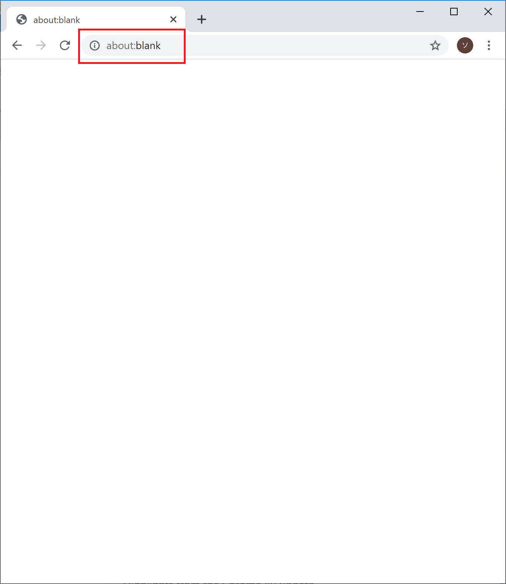
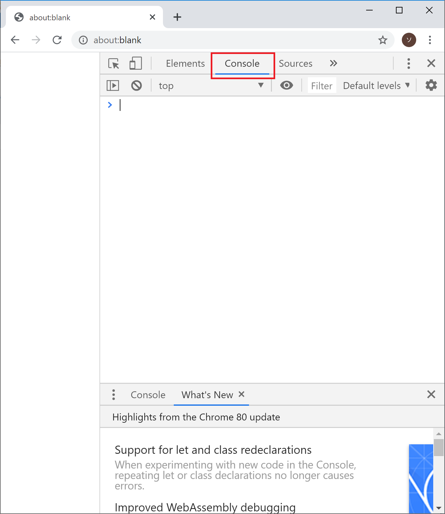
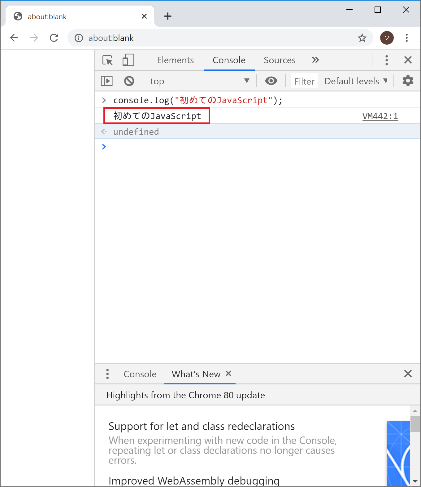
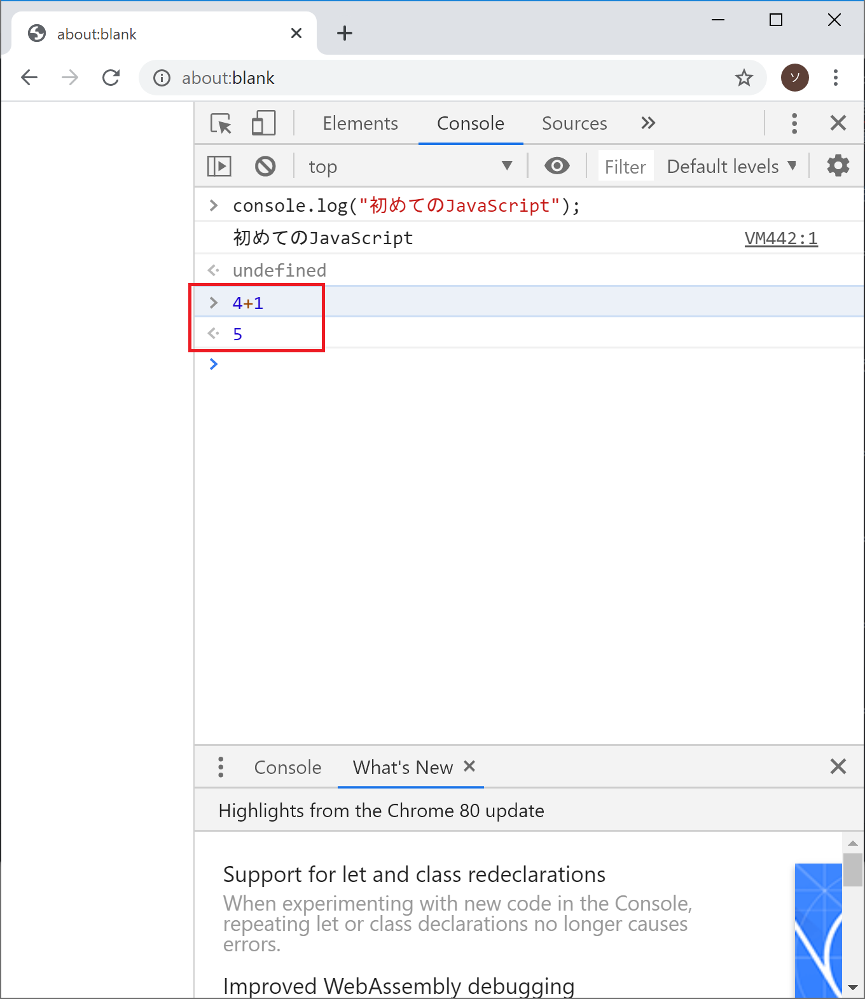
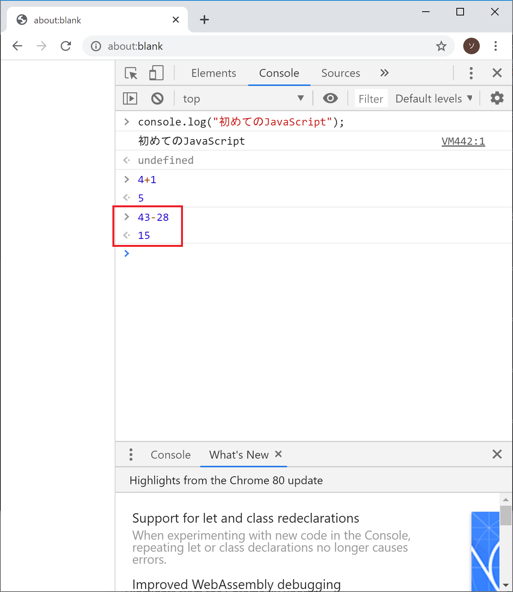
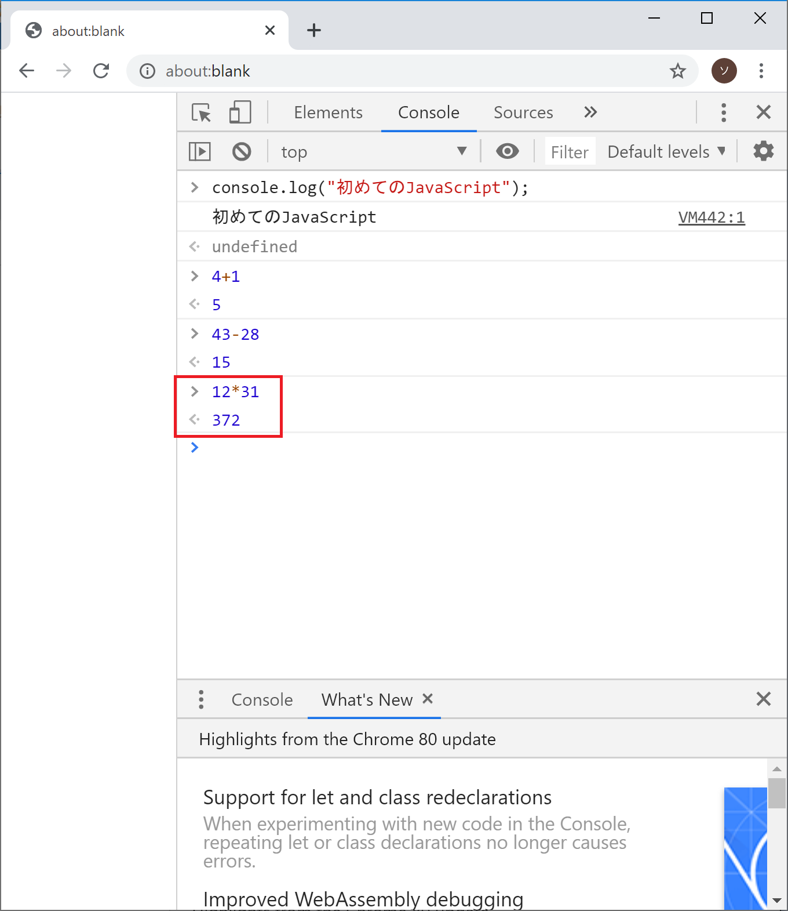
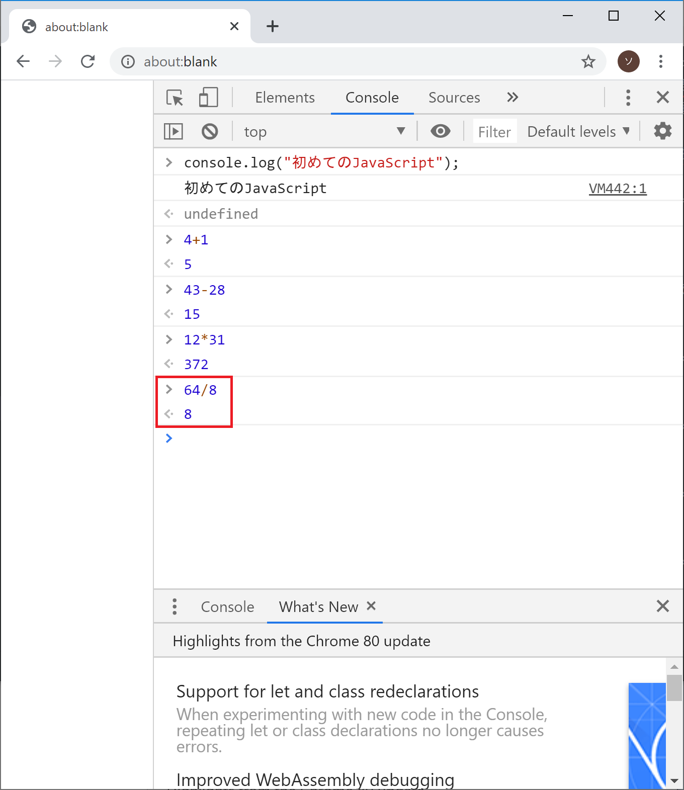
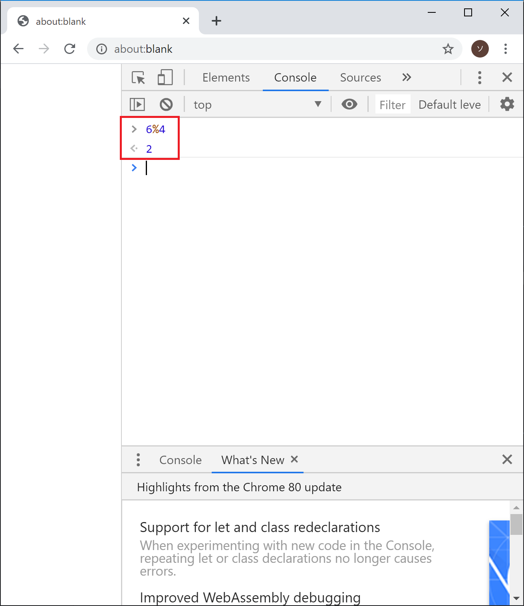
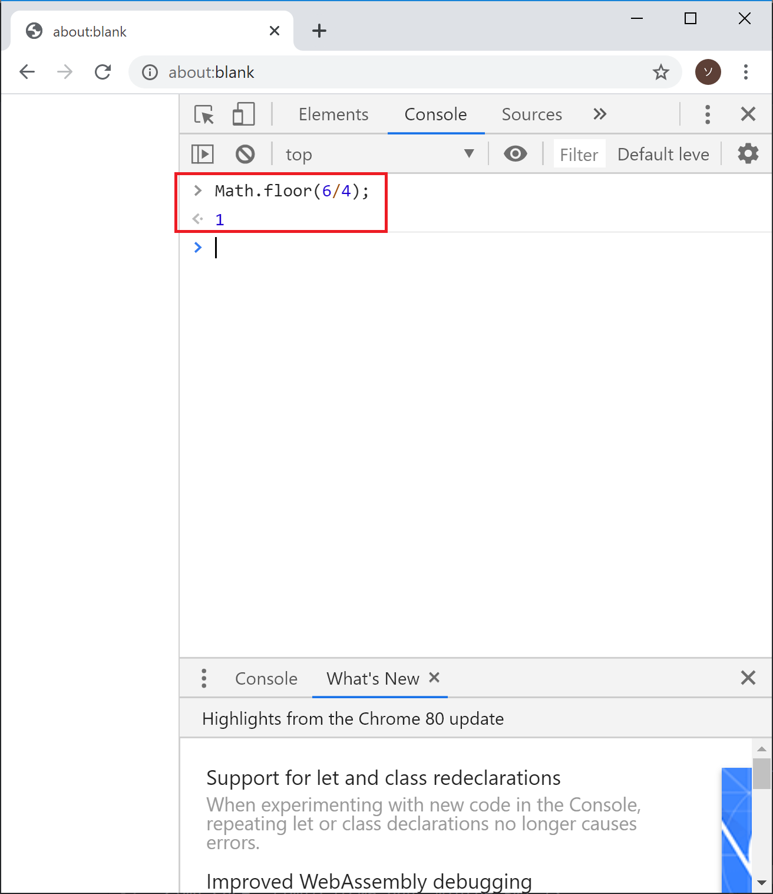
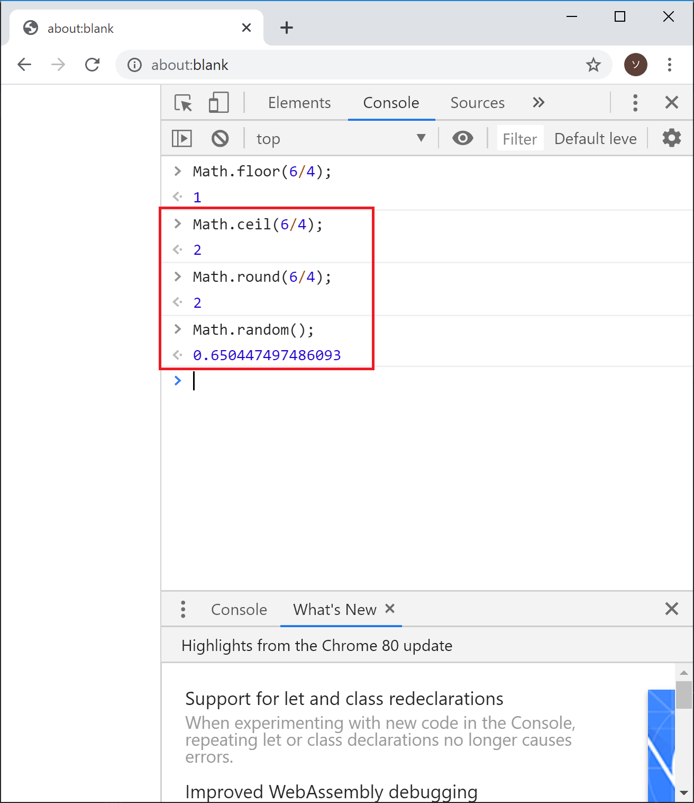

## ブラウザのConsole画面の使い方
JavaScriptを触ってみようということで、お手軽にJavaScriptを書いて動かせるブラウザのConsole画面の説明からしたいと思います。

JavaScriptを書いて動かしやすい環境なのでGoogle Chromeで説明します。

### 空白ページを開く
まずはChromeを開いて、アドレスバーに「about:blank」と入力してEnterを押します。
そうすると空白ページが出てきます。

### デベロッパーツールを開く
次にF12を押します。そうすると右側に新しい画面が出てきます。
Chromeではこの画面を**デベロッパーツール**といいます。
デベロッパーは開発者という意味です。

赤枠で囲ったConsoleというところが開かれていれば準備OKです。

### ConsoleにJavaScriptのコードを入力してみる
ConsoleでJavaScriptを実行する手順を確認しておきましょう。

Console画面に下記のように入力してみてください。
自分で書いたコードの意味が理解できるようになるのも目標の1つなので、コピペではく手入力してください。

`console.log("初めてのJavaScript");`

Enterを押すと実行されます。
赤枠で囲った「初めてのJavaScript」が実行結果です。
console.log();は()の中身をそのままConsole画面に表示する関数です。
この後もいろいろな場面で利用しますので覚えておいてください。

### 四則演算してみる
Console画面の入力に慣れるために、四則演算してみましょう。

`4+1`

`43-28`

`12*31`

`64/8`

### きれいに割り切れない数の割り算について
JavaScriptに限らず、プログラミングにおいてきれいに割り切れない数の割り算はとても重要なテーマです。

特に割り算の余りの部分が重要で、余りの値を使って処理を作ることがよくあります。

そこできれいに割り切れない数について見ていきます。

#### まずは普通に割る

`6/4`

1.5と答えが出てきました。JavaScriptでは一般的な人間が想定しているような答えを返してくれるようです。

余談ですがプログラミング言語の中には小数点までは自動計算してくれず、単に「1」と返すものもあります。

ひとまずここではJavaScriptは少数点まで自動計算してくれることを確認しました。

### 余りだけを取り出したい
次に余りだけを取り出したい場合について見ていきます。

プログラミング言語には四則演算だけでなく、余りを求める演算子も定義されています。

JavaScriptでは余りを求める際は「%」を使います。

`6%4`

ちなみになぜ余りを求める演算子が生まれたのかですが、調べてみても分かりませんでした・・・おそらく単純によく使うからだと思われます。

#### 商だけ取り出したい
では商だけを取り出したい場合は、どのようにすればいいでしょうか？

JavaScriptに標準で準備されている機能の1つに、商だけを取り出すものがあります。
それを使ってみましょう。

`Math.floor(6/4)`

MathはMathematicsの略で数学という意味です。
Mathの中に数学に関する機能がたくさん詰まっています。

数学に関する組み込み機能を使う場合は、Mathの後に.（ドット）を書いて、そのあとに機能名をつけて呼び出します。

例えば以下のようなものがあります。
- Math.floor(数値)
  - 切り捨て
- Math.ceil(数値)
  -切り上げ
- Math.round(数値)
  -四捨五入
- Math.random()
  - 0以上1未満のランダムな数値を返す（乱数）

※ここでは紹介しませんが、機能は他にも[たくさんあります](https://developer.mozilla.org/ja/docs/Web/JavaScript/Reference/Global_Objects/Math)。

### まとめ
ここまででConsole画面にコードを入力して実行する流れが分かったと思います。

ちなみにF5などを押すと画面が再読み込みされて、Console画面の中身もクリアされます。

このあとの記事で数行程度のコードを書く予定ですが、データを消さずに保存しておきたい場合はメモ帳などに書いてからコピペすることをオススメします。

[< JavaScriptについて](./index.html) | [変数の基本 >](./index3.html)
