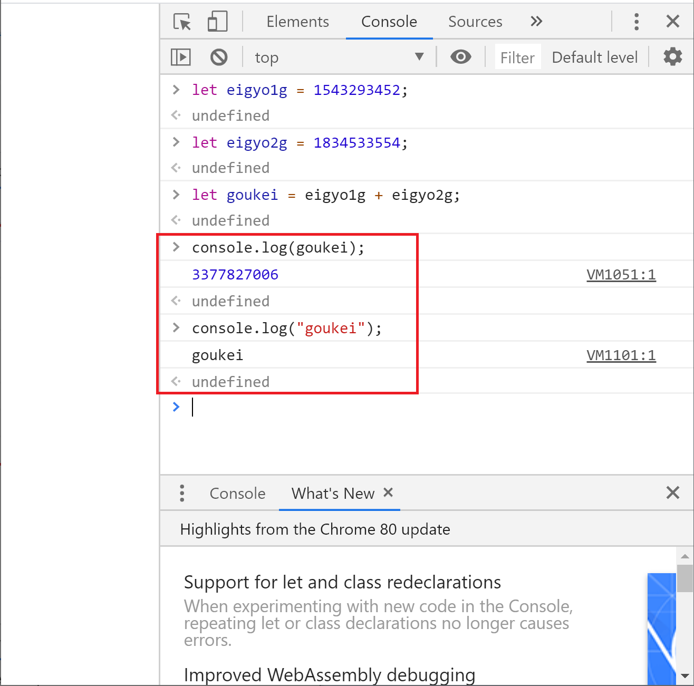
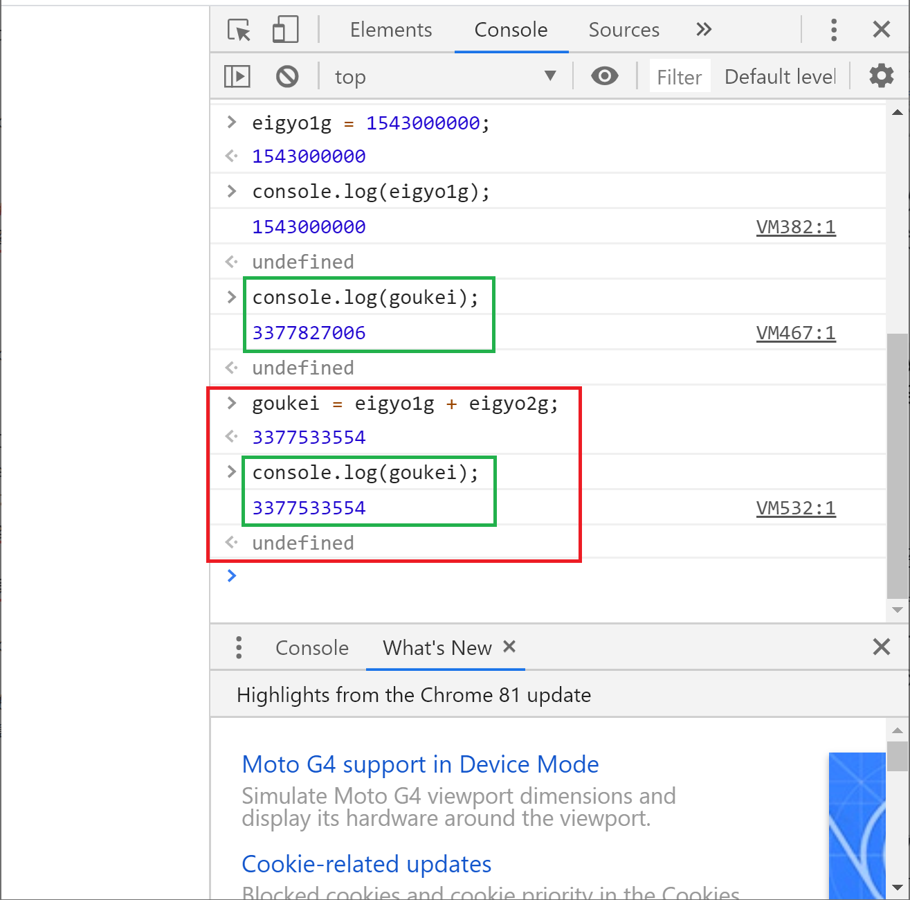

## 変数の基本
プログラミングを行う上で避けては通れない変数について、基本を学びます。

### 変数とは
変数をひとことで表すと「一時的にデータを保存しておくための場所」です。

すみません。たぶん言葉では伝わりにくいので、さっさとコードを書いて動きを見ながら進めましょう。


### 変数を使わない処理の例
例えば、営業部に2つのグループがあったとします。
各グループの昨年度売り上げは以下の通りです。
- 営業1G：1,543,293,452円
- 営業2G：1,834,533,554円

では営業部の売り上げはいくらでしょう？
Console画面で計算してみましょう。

```
1543293452+1834533554
```


見事に計算できました。

では次に平均値を計算してみましょう。
```
(1543293452+1834533554)/2
```


これも計算できましたね。

ここで計算式を見直してみてください。
プログラムでこの売り上げ金額を扱う際に以下のような問題が出てきます。
- あとから見返した時になんの計算をしていたのかが分からない
- っていうか、いまは2つしかデータがないからいいけど、データの数が増えるとどの数字がなんなのか分からなくなる
- 数字が訂正になったら、すべての場所で数字を書き換えないといけない
- 金額が登場する度に数字を見ながら打つのめんどい
- 数字を見ながら何度も売っていると間違えそう

### 変数を使った処理
そこで変数の出番です。
変数を使って同じ計算をやってみましょう。
まずは営業部の売り上げの計算です。

```
let eigyo1g = 1543293452;
let eigyo2g = 1834533554;
let goukei = eigyo1g + eigyo2g;
console.log(goukei);
```


よくわかんないけど確かに計算結果として同じものが出ましたね。
では何をやっているのかを読み解いてみましょう。

### 変数を使った処理の解説
```
let eigyo1g = 1543293452;
```
「let eigyo1g」というところでeigyo1gという名前の変数を作っています。

eigyo1gは私が勝手に決めました。
理由は営業1Gのデータを一時的に保存する場所として分かりやすい名前だからです。
あとから何が入っているのか分かるように名前を付けましょう。
いろいろなプログラミング言語で応用しやすいので、名前を付ける際は以下のルールをオススメします。
- 頭文字はアルファベットを使う
- 2文字目以降は英数か_（アンダースコア）を使う
- 誰が見ても分かるような名前がオススメ

そのあとの「 = 1543293452」で変数に一時的に保存するデータとして1543293452を設定しています。

```
let eigyo2g = 1834533554;
```
ここは営業1Gと同じ考え方ですね。営業2G分の変数を作って、売り上げデータを一時的に保存しています。

```
let goukei = eigyo1g + eigyo2g;
```
合計値を格納したいので「let goukei」でgoukeiという名前の変数を作っています。
もちろん名前は私が勝手に決めているので、別の名前でも構いません。

「= eigyo1g + eigyo2g」がポイントですね。
意味が分かるように変数名を付けているので、式を見れば営業1Gと営業2Gの売り上げを合計していることが分かります。

```
console.log(goukei);
```
ここは前のページでも使ったconsle.log()ですね。
この一文でgoukeiの内容をConsole画面に表示しています。

ポイントは内側の文字を""（ダブルクオーテーション）で囲っていないところです。

ダブルクオーテーションで囲った場合、中身をそのまま表示します。

ダブルクオーテーションで囲っていない場合は変数として扱います。

比較のために2つのパターンを書いておきます。
```
console.log(goukei);
console.log("goukei");
```



### 変数の中身を入れ替える
変数の中身を入れ替えることも可能です。

```
eigyo1g = 1543000000;
console.log(eigyo1g);
```


ここで1つ間違えやすいポイントをお話しします。
eigyo1gの中身を入れ替えましたが、この入れ替えによってgoukeiの中身は変わりません。
goukeiについては計算を行った時点での結果が入っているからです。

実際に見てみましょう。
```
console.log(goukei);
```


もしeigyo1gの数値を入れ替えた結果を反映させたいのであれば、同じ計算をもう一度行う必要があります。

```
goukei = eigyo1g + eigyo2g;
console.log(goukei);
```



### 変数に格納されたデータを処理して、同じ変数に入れ直す
変数に格納されたデータを処理して、その結果を同じ変数に入れ直すこともできます。

まずは数値の場合を見てみましょう。

```
let data1 = 12345;
console.log(data1);
data1 = data1 + 12345;
console.log(data1);
```


続いて文字列の場合です。

```
let data2 = "私は";
console.log(data2);
data2 = data2 + "グリーンラベルが好き！";
console.log(data2);
```


### まとめ
- 「let 変数名」で変数を作る
- 「変数名 = データの中身」で指定した変数に対して一時的にデータを保存できる
- 変数を使うことで式が読みやすくなる。


### 備考
ちなみにプログラミング言語には変数の扱い方で種類があります。

JavaScriptは動的型付け言語と言って、変数の扱いは良くも悪くも緩いです。（なので入門しやすいです。）

対してVBA、C言語、Javaなどは静的型付け言語と呼ばれていて、変数を宣言する際に「この変数は数値を入れる用です」とか「この変数は文字列が入ります」などを指定する必要があります。

それぞれメリット・デメリットがあるのでどちらが優れているというわけではなく、向き不向きがあるイメージです。

もしこのJavaScript入門を終えて他の言語を学ぶ場合は、その言語が動的型付けなのか静的型付けなのかを確認してみてください。
そして動的型付けの場合は、ここで学んだ内容にプラスして型付けについて学ぶ必要があることを覚えておいてください。


[< ブラウザのConsole画面の使い方](./index2.html) | [順次処理 >](./index4.html)


[0.JavaScriptについて](./index.html)
[1.ブラウザのConsole画面の使い方](./index2.html)
[2.変数の基本](./index3.html)
[3.順次処理](./index4.html)
[4.分岐処理](./index5.html)
[5.反復処理](./index6.html)
[6.関数](./index7.html)
[7.データ構造について](./index8.html)
[8.Web APIを叩いてみよう](./index9.html)
[9.HTMLと組み合わせて使ってみよう](./index10.html)
