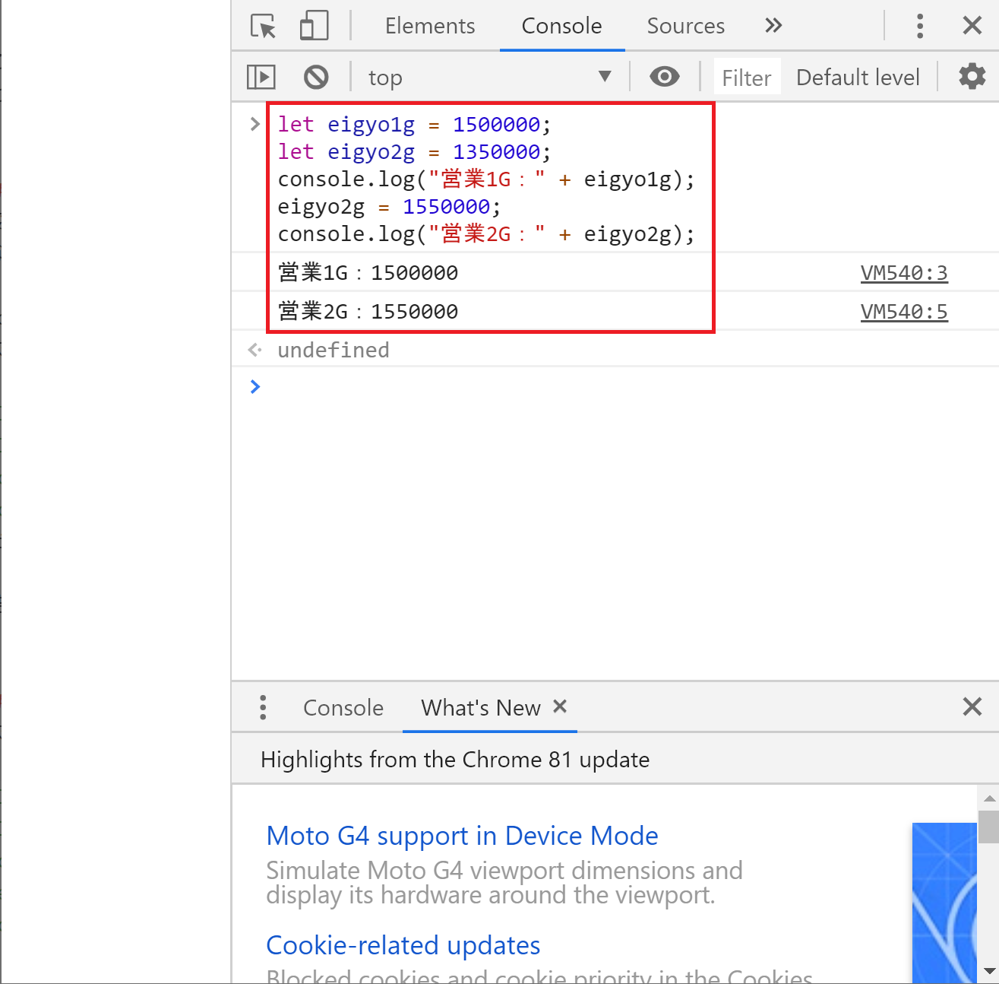

## 順次処理
次はプログラミングにおける基本処理の話に移ります。

おさらいですが、プログラミングにおける基本処理は以下の3つです。
- 順次処理
- 分岐処理
- 反復処理

この3つを組み合わせることで、複雑なプログラムが書けてしまうんです。
びっくりですね。

それでは、まずは順次処理から見ていきましょう。

### 順次処理とは
最初のページで、プログラムはコンピュータに作業をお願いする時の手順書で、基本的には上から順番に書かれていることを実行すると説明をしました。

この上から順番に書かれていることを実行するという処理を**順次処理**といいます。


### 順次処理を体験しよう
変数のページで書いたコードが順次処理の流れだったのでそんなに説明いらないかもですが、念のため順次処理を体験してみましょう。

Console画面へのコードの入れ方を今までと少し変えてみます。
次の4行をメモ帳に書いて、まとめてコピペして実行してみてください。

```
let eigyo1g = 1500000;
let eigyo2g = 1350000;
console.log("営業1G：" + eigyo1g);
console.log("営業2G：" + eigyo2g);
```


結果を見ると上から順番に実行されているのが分かると思います。


### 順次処理をもう少し見てみよう
次に4行目にeigyo2gを書き換えるコードを追加してみます。

F5などでページをクリアしてから、以下の5行をメモ帳に書いてまとめてコピペしてください。

```
let eigyo1g = 1500000;
let eigyo2g = 1350000;
console.log("営業1G：" + eigyo1g);
eigyo2g = 1550000;
console.log("営業2G：" + eigyo2g);
```


console.log()の結果を見ると、追加したコードによってeigyo2gの内容が書き換えられているのが分かります。

順番通りに処理されているイメージが湧いたでしょうか。


### まとめ
プログラムを上から順番に実行するのが順次処理でした。

特に難しいことを言ってないですが、実はこの考え方をきちんと理解できているかが非常に重要です。

今回はJavaScriptで説明をしていますが、他のプログラミング言語だけでなくHTMLやCSSなども上から順番に読み込むという点では動作は同じです。

この入門でもどこかで取り上げる予定ですが、HTMLとJavaScriptを組み合わせて使う際に、プログラムの内容は正しいが、読み込む順番が正しくないせいで動かないという失敗がよくあります。

順次処理は当たり前だけど奥が深いので、プログラムを書く場合は常に意識するようにしてください。

[< 変数の基本](./index3.html) | [分岐処理 >](./index5.html)


[0.JavaScriptについて](./index.html)
[1.ブラウザのConsole画面の使い方](./index2.html)
[2.変数の基本](./index3.html)
[3.順次処理](./index4.html)
[4.分岐処理](./index5.html)
[5.反復処理](./index6.html)
[6.関数](./index7.html)
[7.Web APIを叩いてみよう　前置き編](./index8.html)
[8.Web APIを叩いてみよう　実践編](./index9.html)
[9.HTMLと組み合わせて使ってみよう](./index10.html)
