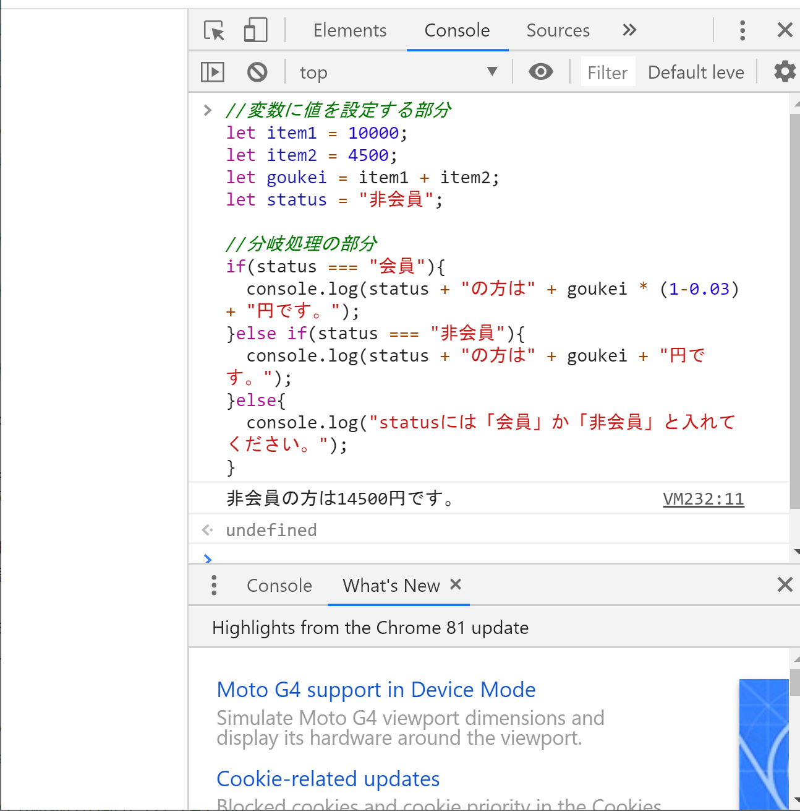

## 分岐処理
おさらいですが、プログラミングにおける基本処理は以下の3つです。
- 順次処理
- 分岐処理
- 反復処理

次は2つ目の分岐処理について見ていきます。


### 分岐処理とは
プログラムは基本的には上から下に書かれた順に順次処理を行っていきます。
しかし、順次処理だけだと条件に合わせた処理を書くことができません。

例えば通販サイトの料金計算プログラムがあったとして、
非会員の場合は定価での販売、会員の場合は合計額から3%オフといった処理をしたい場合に
順次処理では相手に合わせて料金を出し分けることができません。

このように条件に合わせて処理の内容を変えたい場合に、
分岐処理を使います。


### 分岐処理を体験しよう
文法の説明は後にして、まずは分岐処理を体験してみましょう。

上の通販サイトの例で、非会員が商品を2つ（10000円と4500円）を買った場合でサンプルコードを書いてみたいと思います。

意味が分からなくてもちゃんと手打ちしてくださいね。
手打ちすることであとから内容が入ってきやすくなります。

```
//変数に値を設定する部分
let item1 = 10000;
let item2 = 4500;
let goukei = item1 + item2;
let status = "非会員";

//分岐処理の部分
if(status === "会員"){
  console.log(status + "の方は" + goukei * (1-0.03) + "円です。");
}else if(status === "非会員"){
  console.log(status + "の方は" + goukei + "円です。");
}else{
  console.log("statusには「会員」か「非会員」と入れてください。");
}
```


よくわからないですが、宣言通り非会員が商品を2つ買った時の料金が出てきたと思います。

非会員だけの処理を見ても本当に分岐処理になっているのか分からないと思うので、statusを会員に変更して分岐処理を実行してみましょう。

さきほどの画面に続けて入力することで、statusを入れ替えて処理を実行します。

```
//statusの中身を入れ替える
status = "会員";

//分岐処理の部分（さっきと同じ）
if(status === "会員"){
  console.log(status + "の方は" + goukei * (1-0.03) + "円です。");
}else if(status === "非会員"){
  console.log(status + "の方は" + goukei + "円です。");
}else{
  console.log("statusには「会員」か「非会員」と入れてください。");
};
```


statusを会員に変更したことで、分岐処理の結果に会員の料金（合計金額から3%オフ）が表示されました。

条件によって処理の内容を変えられていることが確認できましたね。


### 分岐処理の解説
では処理の中身について解説していきます。

```
//変数に値を設定する部分
```
まず最初に日本語で説明のようなものが書かれています。
これはコメントと呼ばれるもので、プログラム内に説明文をつける機能です。
JavaScriptの場合は「//」と書くとその後ろがコメント扱いになります。
「//」の後ろはプログラムとしては処理されないので、文末の「;」は必要ありません。

プログラミングの世界では「3日経てば自分も他人」のような言い方があります。
自分が書いたプログラムであっても、3日も経つと初めて見るプログラムみたいに読めなくなるんですよ・・・。

他人とプログラムを共有する際に必要というだけでなく、未来の自分のためにも、どういう処理を行っているパートなのかが分かるようにコメントを残しておくことがおススメです。


```
let item1 = 10000;
let item2 = 4500;
let goukei = item1 + item2;
let status = "非会員";
```
続いて変数に値を設定する処理です。
この部分は今までのページで解説した内容なので、みなさんならもう読み解けると思います。

商品2つに価格を設定する処理がitem1とitem2のところです。
goukeiはitem1とitem2の価格を足して合計金額を計算する処理です。

そして最後にstatusとして非会員を設定しています。


```
//分岐処理の部分
if(status === "会員"){
  console.log(status + "の方は" + goukei * (1-0.03) + "円です。");
}else if(status === "非会員"){
  console.log(status + "の方は" + goukei + "円です。");
}else{
  console.log("statusには「会員」か「非会員」と入れてください。");
}
```
続いて分岐処理のところを見ていきましょう。

最初にコメントで処理の内容を説明しています。

次に始めている構文がでてきます。
if文と呼ばれる処理です。

文法の説明の前に、ここで書かれている内容を日本語に訳してみます。

※今回は先にプログラムを書いてから日本語に訳しましたが、実際に自分でプログラムを書く際は日本語で処理の内容をまとめてからJavaScriptに翻訳していくのがおススメです。

```
もし会員ステータスが会員だったら{
  コンソール画面に「会員の方は〇〇〇円（合計の3%引きの金額）です」と表示する。
}もし会員ステータスが非会員だったら{
  コンソール画面に「会員の方は×××円（割引なしの金額）です」と表示する。  
}それ以外の場合は{
  コンソール画面に「statusは会員か非会員を入れるように警告を出す
}
```


[< 順次処理](./index4.html) | [反復処理 >](./index6.html)
