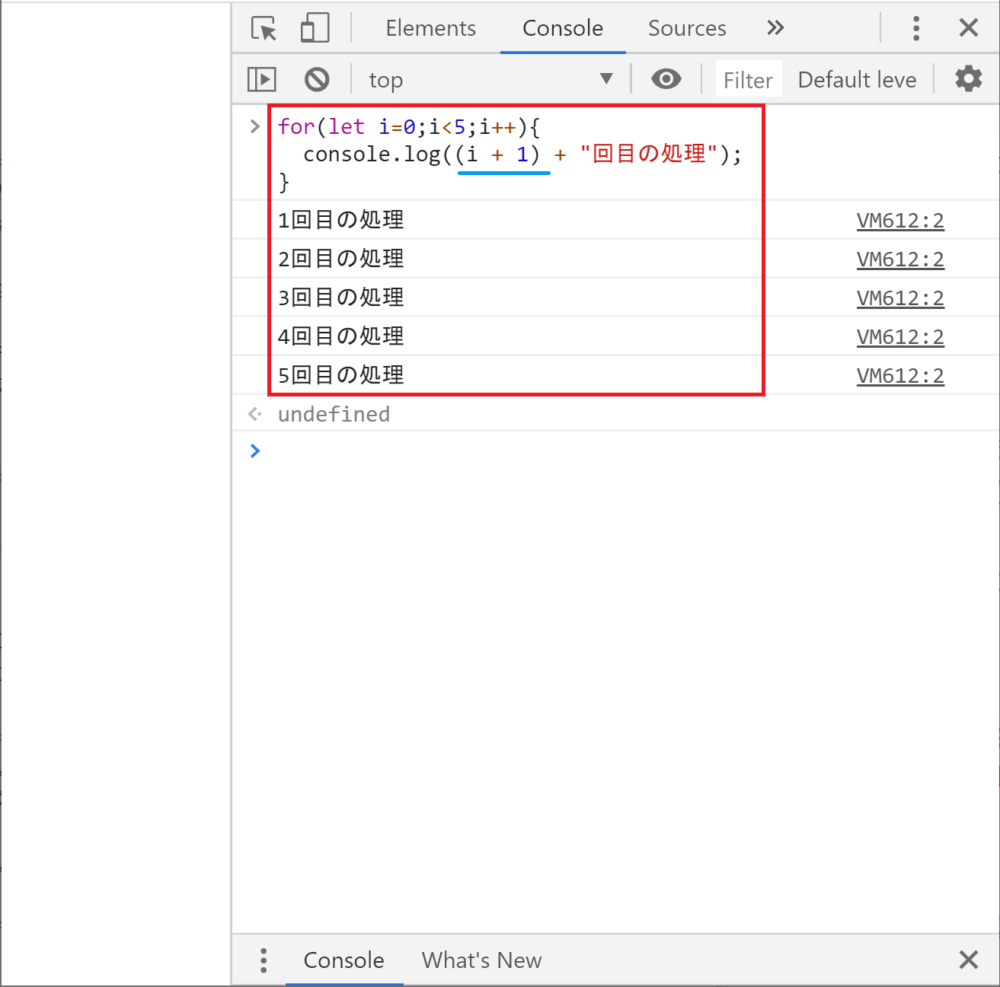

## 反復処理
続いて反復処理についてです。
反復処理を身に着けるとプログラミングの可能性が一気に開けます。
超重要です。


### 反復処理とは
決められた条件の範囲内で処理を繰り返すことを反復処理といいます。
よくいうループというのは反復処理のことを指しています。

今回の入門で扱う範囲を超えますが、実用的な例でいうとCSVのデータを1行ずつ読み込んで必要な情報を抜き出すといった処理が反復処理を使って作成可能です。

ここではまずは反復処理の基本を押さえます。

### 反復処理を体験しよう
それでは反復処理を体験してみましょう。

反復処理の書き方はいくつかありますが、ここでは代表的な例としてfor文を使った反復処理を体験します。
まずはコンソール画面に「〇回目の処理」というのを表示してみたいと思います。
〇はループの回数です。

```
for(let i=0;i<5;i++){
  console.log(i + "回目の処理");
}
```


0回目～4回目の合計5回の処理が行われました。


### 反復処理の解説
それでは反復処理の内容を見ていきましょう。

まずは基本的なif文の書き方を説明します。

【JavaScript】
```
for(カウンターの初期化;条件式;処理が1回終わった後に行う計算){
  条件を満たした場合の処理
}
```

かなりプログラミング的な書き方になってきましたが、日本語で書き下せば意味は分かると思います。
では見ていきましょう。

#### カウンターの初期化
まずカウンターの初期化という項目から始めます。

反復処理を行う場合、何回繰り返せばいいでしょう？
無限に処理を繰り返すシステムなんて、リソースを無駄遣いするダメなシステムですよね。
したがって反復処理を行う中で、何かしら条件を付けてもう1度処理を継続するかどうかについて判断する必要があります。

for文で反復処理を行う場合、一般的によく用いられるのが処理を行った回数を数えて指定した回数を超えたら処理を終了するというやり方です。

その際に処理の回数を数える用の変数をカウンターといいます。カウントする（数える）用の変数なのでカウンターと呼んでいます。

サンプルプログラムでは以下のように書いている部分です。
```
let i=0;
```
ここではカウンターの変数名をiに設定しています。
歴史的な経緯から一般作法として、for文のカウンターにはiがよく使われます。

そして初期値として0に設定しています。
プログラムの中では0始まりで数を数えなければいけないケースが多々あるため、それに慣れてもらうために今回の処理も初期値を０に設定しました。

結果、初期値がゼロのカウンターが作られたことになります。

#### 条件式
続いて条件式についてです。

反復処理を継続するかどうかの判断をするのがここになります。

サンプルプログラムでは以下のように書いている部分です。
```
i<5;
```

if文の条件式と同じ書き方になっています。
ここではiが５未満の場合は処理を継続するという条件になっています。


#### 処理が1回終わった後に行う計算
続いて処理が1回終わった後に行う計算です。

サンプルプログラムでは以下のように書いている部分です。
```
i++
```

++はインクリメントと呼ばれる処理です。
変数の値を1だけ増やしたい場合にこのような書き方をします。


#### 条件を満たした場合の処理
条件式を満たした場合に行う処理を書く場所です。

サンプルプログラムでは以下の処理を書いています。
```
console.log(i + "回目の処理");
```

ポイントはカウンターとして作成した変数iを利用しているところです。
こうすることで処理回数に合わせてコンソールに表示する内容を変えることができます。


#### 処理のを追いかけてみよう
1 カウンターの初期値として0を設定
- iは0なのでi<5の条件を満たしていると判断
- コンソール画面に「0回目の処理」と表示
- 処理が終わったのでi++を実行。iの中身は1になる。
- iは1なのでi<5の条件を満たしていると判断
- コンソール画面に「1回目の処理」と表示
- （中略）
- コンソール画面に「4回目の処理」と表示
- 処理が終わったのでi++を実行。iの中身は5になる。
- iは5なのでi<5の条件を満たさない。for文による反復処理を終了。


### その他１　処理結果の表示を人間に見やすくしてみよう
カウンターは0から始めるがコンソール画面は人間に分かりやすく1から始めたい場合にどうすればいいか考えてみてください。

ぱっと思いつきましたか？

for文とは全く関係なく、条件に当てはまった時の処理を少し書き換えるだけですね。

```
for(let i=0;i<5;i++){
  console.log((i + 1) + "回目の処理");
}
```


こんな感じでコンピュータの処理と人間に対してのUXのバランスを取りながら処理を書いていきます。

### その他２　処理の回数を増やしてみよう
処理手順が決まってさえれば、回数がべらぼうに増えてもコンピュータは文句を言いません。

処理回数を5回から10000回に増やしてみましょう。
```
for(let i=0;i<10000;i++){
  console.log((i + 1) + "回目の処理");
}
```


### まとめ
反復処理を行うことで決められた条件の元でコンピュータが繰り返して処理を行ってくれます。

反復処理をうまく使えるようになると、大量のデータを処理するなども自動化できるようになります。


### 備考
処理手順をきちんと決めてプログラムに落とし込むことができれば、コンピュータが人間の代わりに処理をしてくれるようになります。
しかもミスなく高速に行ってくれます。

また処理件数が膨大でコンピュータでも時間がかかる処理の場合でも、コンピュータが処理を行ってくれている間に人間は別の仕事を並行して進めることができるため生産性があがります。

ただしプログラミング言語の文法を覚えただけだとプログラムは書けなくて、業務フローなどのフローチャートを書く力も必要になります。
業務指示を出すときは人間相手でもコンピュータ相手でもフローが必要なんですね。


[< 分岐処理](./index5.html) | [関数 >](./index7.html)

<hr>

[0.JavaScriptについて](./index.html)
[1.ブラウザのConsole画面の使い方](./index2.html)
[2.変数の基本](./index3.html)
[3.順次処理](./index4.html)
[4.分岐処理](./index5.html)
[5.反復処理](./index6.html)
[6.関数](./index7.html)
[7.データ構造について](./index8.html)
[8.Web APIを叩いてみよう](./index9.html)
[9.HTMLと組み合わせて使ってみよう](./index10.html)
