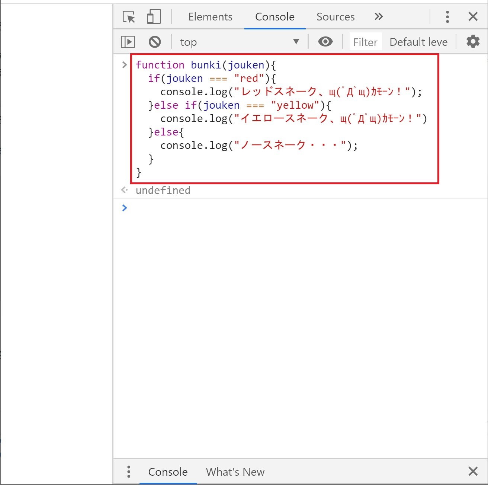
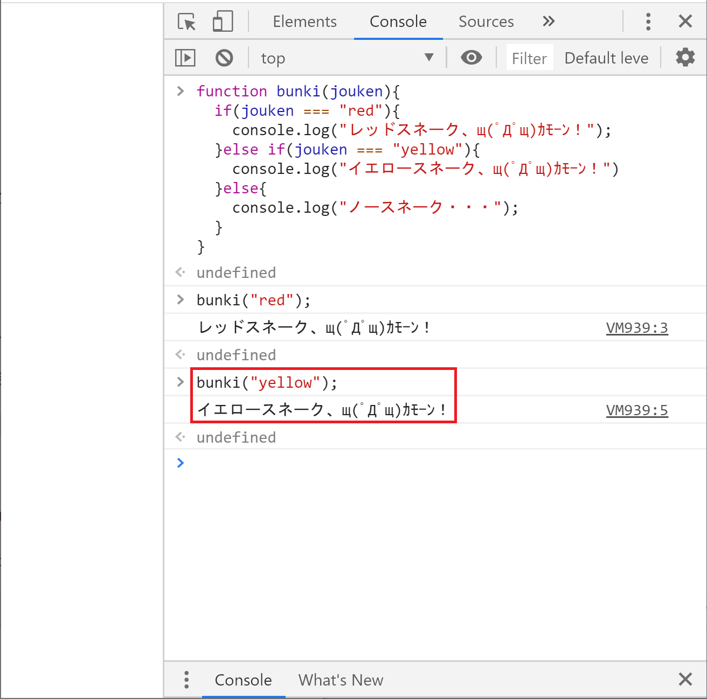
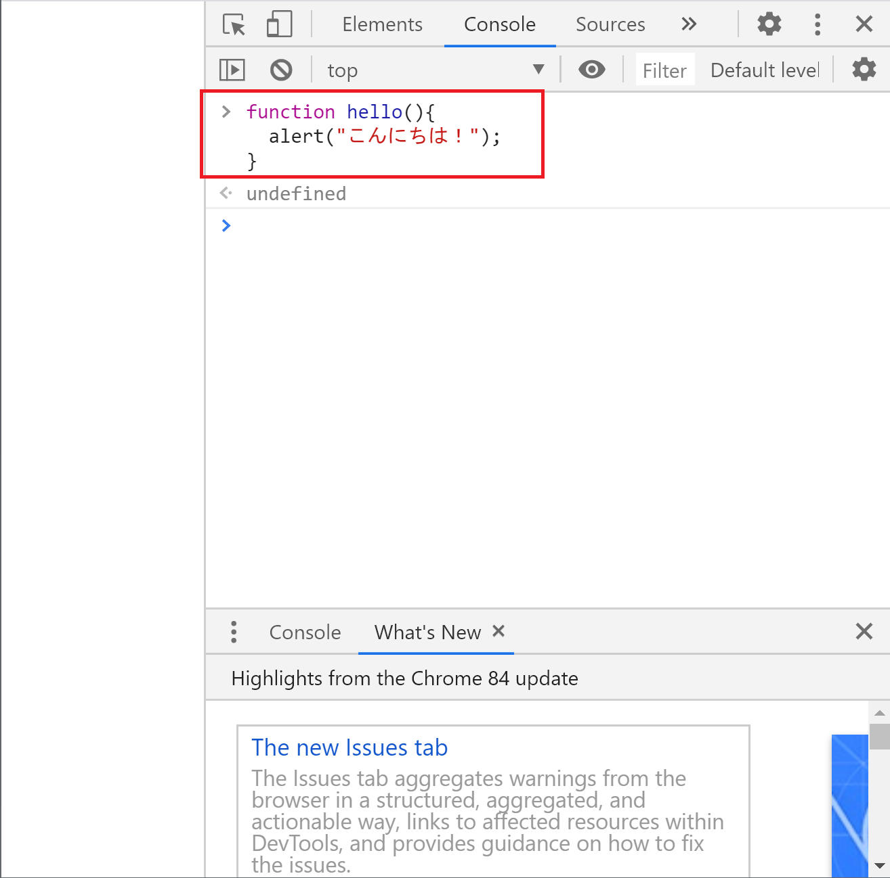
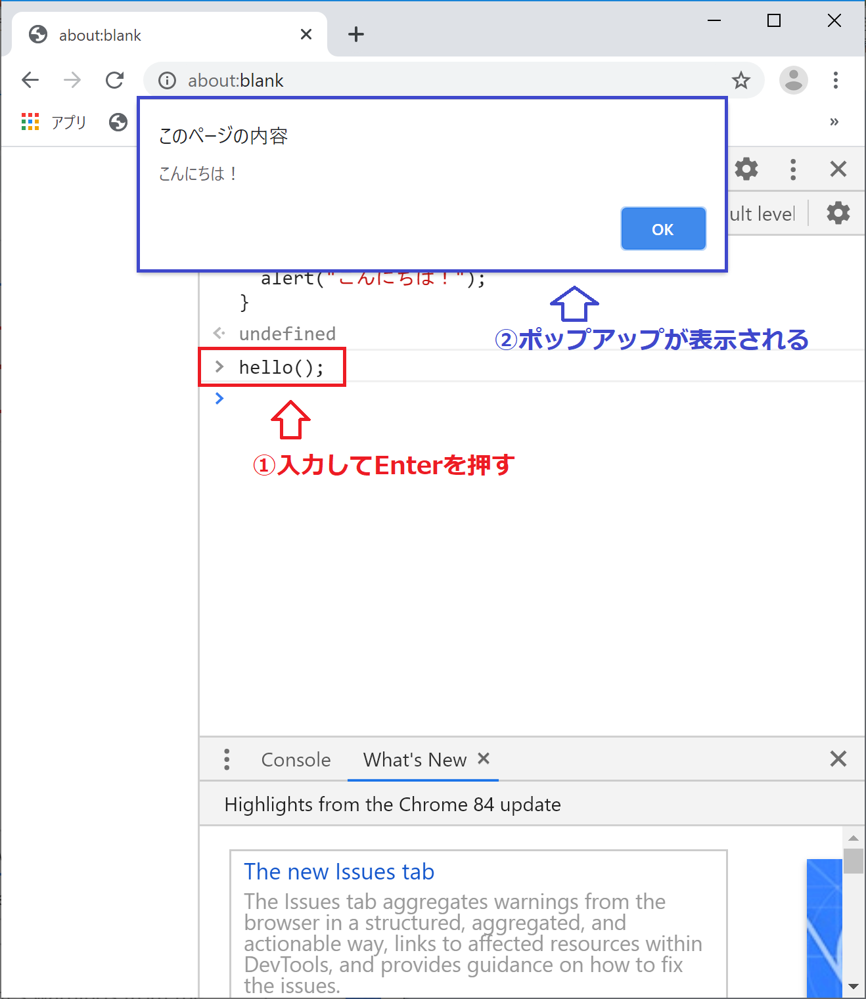
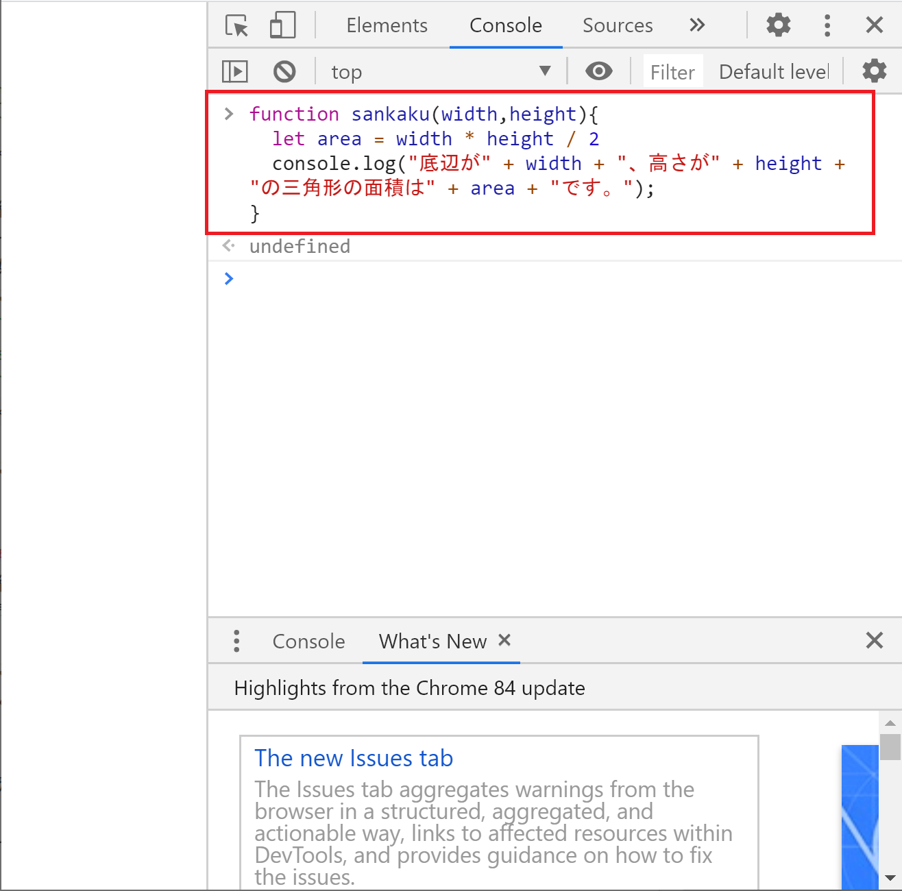
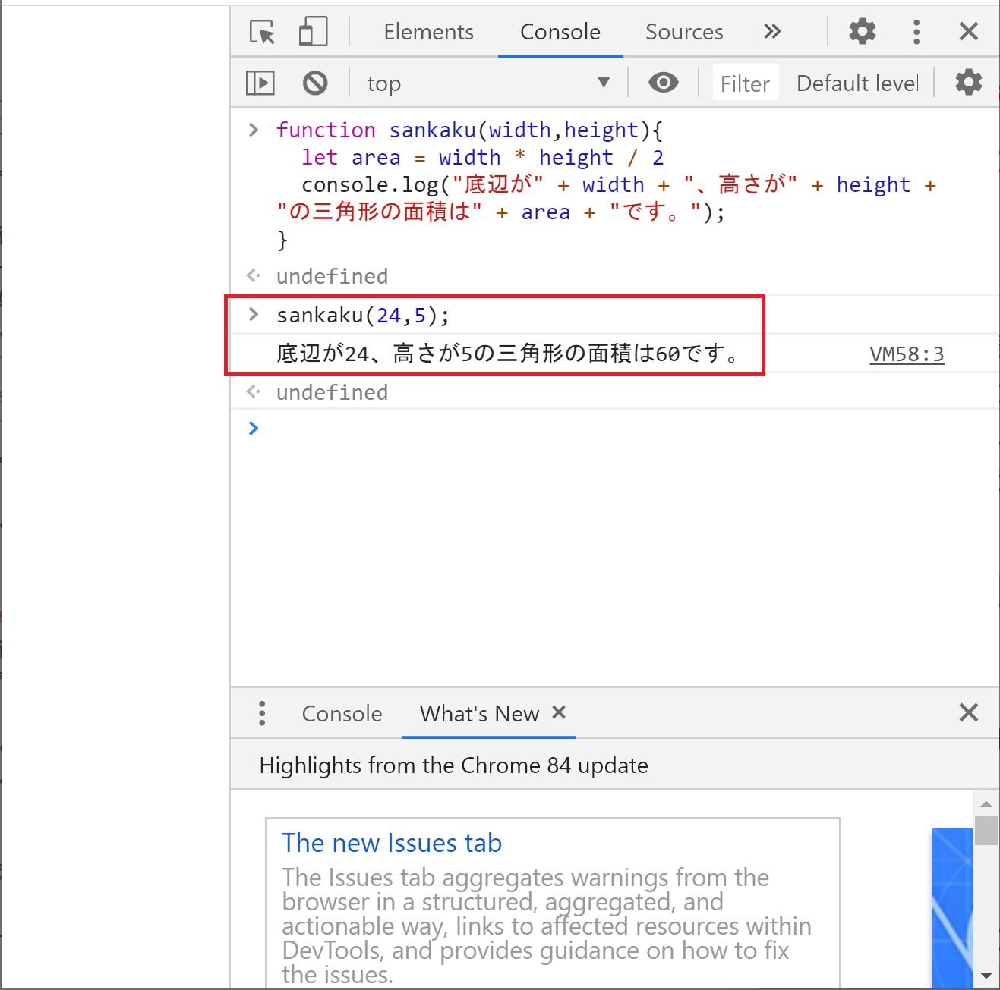
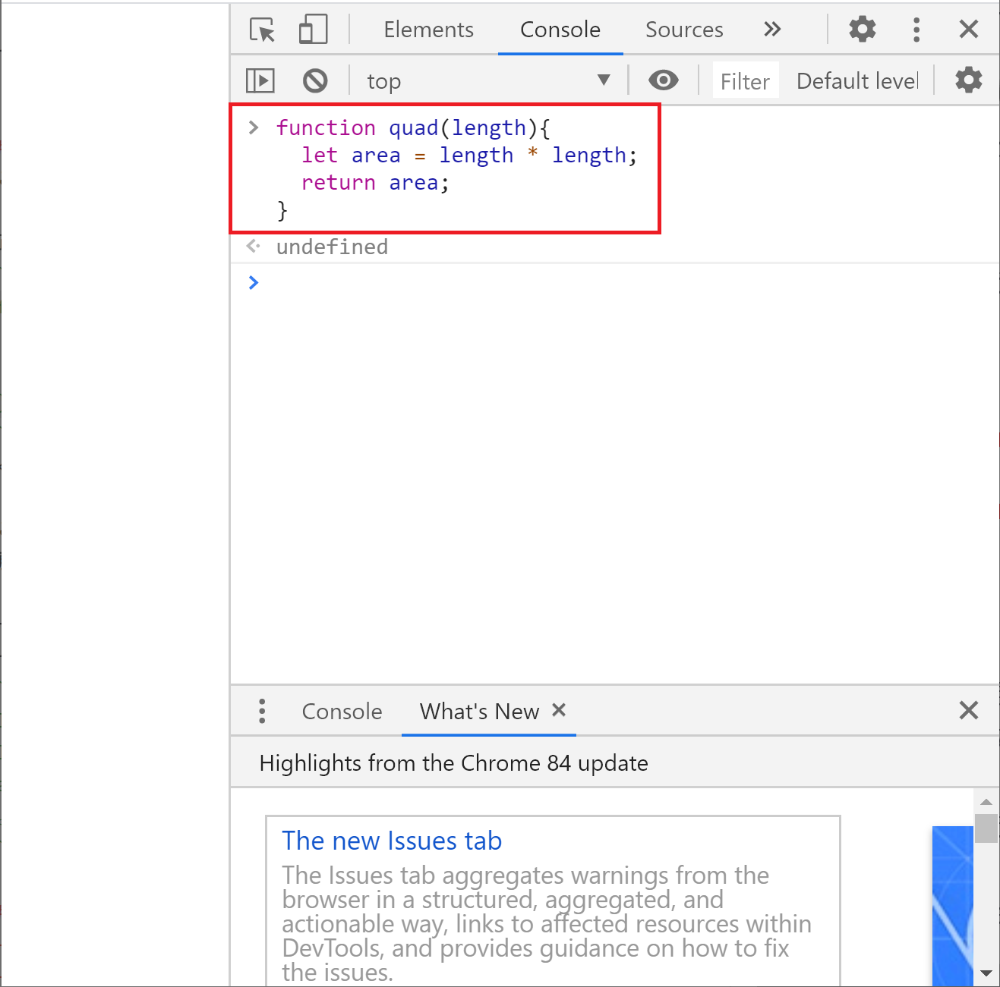

## 関数
ここまでのレッスンでJavaScriptの基本的な書き方を学びました。

次は関数について学んでいきましょう。


### 関数とは
みなさんは関数というと何を思い浮かべるでしょう？
多くの方はExcelの関数を思い出すんじゃないでしょうか。

例えばSUM関数であれば、与えられた数値をすべて足し算して、その計算結果を返すという処理になります。

このようにプログラミングにおける関数は、実行したい処理をまとめて名前を付けたものとなります。

そしてプログラミングの世界では、この関数を自分で作って使いこなしていくことになります。

例えば分岐処理のレッスンでは同じif文を何度も入力しましたが、関数を使えばあの手間がなくなります。
実際に試してみます。

### 関数を体験しよう
それではまずは関数を体験してみましょう。

まずは関数を定義します。
ここではbunkiという名前の関数を作っています。
```
function bunki(jouken){
  if(jouken === "red"){
    console.log("レッドスネーク、щ(ﾟДﾟщ)ｶﾓｰﾝ！");
  }else if(jouken === "yellow"){
    console.log("イエロースネーク、щ(ﾟДﾟщ)ｶﾓｰﾝ！")
  }else{
    console.log("ノースネーク・・・");
  }
}
```



では定義した関数にredという文字列を渡してみます。
```
bunki("red");
```


レッドスネークが呼び出されました！

今度はyellowという文字列を渡してみます。
```
bunki("yellow");
```


イエロースネークが呼び出されました！

分岐処理にないorangeという文字列を渡してみます。
```
bunki("orange");
```


ノースネークでした・・・


関数とは「実行したい処理をまとめて名前を付けたもの」という定義が少しは感じられたでしょうか？

関数として定義することで、呼び出して何度も使えるのが便利ですね。


### 関数の書式
まずは書式を説明し、その後に用語と動きを解説していきます。

#### 関数の定義方法
詳細はあとで説明しますが、関数を定義する際の書式を先に説明しておきます。

```
function 関数名(引数){
  関数が呼び出された際に実行される処理
}
```

#### 関数の呼び出し方
関数を呼び出す場合の書式を説明します。

```
関数名(引数);
```

### 関数の解説
それでは関数の解説していきます。


#### 引数
引数は「ひきすう」と読みます。

関数を呼び出す際に、関数に渡す値のことを引数と言います。

さきほど作った関数でいうと「bunki」が関数名、「"red"」が引数になります。
redの前後にダブルクオーテーションが入っているのは、文字列として扱い場合の書き方でしたね。
※文字列として扱う場合にダブルクオーテーションが必要なことを忘れちゃった人は[変数の基本](.index3.html)を読み返してください。

ここで関数を定義したコードを確認してみましょう。

一行目に以下のコードがあります。
```
function bunki(jouken){
```

括弧内のjoukenという部分が実は変数になっています。
引数に設定された値は、ここで受け取ることができます。

このコードで具体的に説明すると、bunkiという関数の引数に"red"という値を渡すと、joukenという変数に"red"という値が格納されます。


そして2行目以降に書かれている以下のコードで、変数に格納された値も含めて処理が実行されます。
```
if(jouken === "red"){
  console.log("レッドスネーク、щ(ﾟДﾟщ)ｶﾓｰﾝ！");
}else if(jouken === "yellow"){
  console.log("イエロースネーク、щ(ﾟДﾟщ)ｶﾓｰﾝ！")
}else{
  console.log("ノースネーク・・・");
}
```


ちなみに引数の個数ですが、関数ごとに異なります。

引数が1つの場合はすでにサンプルを見ているので、引数がない場合と引数が2つ以上ある場合について見てみましょう。

##### 引数がない場合
引数なしの場合は以下のように括弧の中を空欄にします。
```
関数名();
```

具体的な例を見てみましょう。
関数が呼び出されるとポップアップで「こんにちは！」と表示されるだけのシンプルなコードを書いてみます。

関数は以下の通りです。
```
function hello(){
  alert("こんにちは！");
}
```



それでは関数を呼び出してみましょう。
```
hello();
```


このように決まった処理を行うだけの関数は引数なしとなります。

##### 引数が2つ以上の場合
2つ以上の引数を使う場合は、カンマ区切りで入力します。
以下は2つの場合の例です。
```
関数名(引数１,引数２);
```

具体的な例を見てみましょう。
三角形の面積を求める関数を作ってみます。

三角形の面積を求める公式は覚えていますか？
以下が公式です。
```
底辺×高さ÷2
```

この計算を関数化してみます。
引数は底辺と高さの2つが必要になりますので、
底辺:width、高さ:heightとして作成してみます。
計算結果はコンソール画面に表示することにします。

では、まずは三角形の面積を求める関数を定義します。
```
function sankaku(width,height){
  let area = width * height / 2
  console.log("底辺が" + width + "、高さが" + height + "の三角形の面積は" + area + "です。");
}
```


続いて関数を実行します。
その際に底辺と高さを与えてみます。
好きな数字を入れてくれてよいです。
ここでは底辺を24、高さを15としています。
```
sankaku(24,5);
```


このように2つ以上の引数を利用することも可能です。


#### 戻り値
続いて戻り値（もどりち）です。
関数が処理を完了する際に、呼び出し元に渡す値を戻り値と言います。

これまでのサンプルでは、例えば計算して結果をコンソールに表示するなど、すべて処理を関数の中で完結させていました。

しかし、様々な処理をプログラムしていく際に、関数で処理をした結果を別の処理で使いたい場合があります。

そうした場合に戻り値を使います。


##### 戻り値を体験してみよう
ここでは簡単な例で戻り値を扱ってみようと思います。

正方形の面積を計算して戻してくれる関数を作ってみます。
```
function quad(length){
  let area = length * length;
  return area;
}
```


この関数から戻り値を受け取ってみましょう。
戻り値を受け取る場合、変数を使うと便利です。

一辺が10の正方形の面積を求めて、変数anserに格納します。
その後、answerの値を使ってconsole.logで答えを表示してみます。
```
let side = 10;
let answer = quad(side);
console.log("一辺が" + side + "の正方形の面積は" + answer + "です。");
```


### まとめ
- 実行したい一連の処理をまとめたものを関数と言います。
- 関数を作成することで作成した処理を再利用することができます。
- 関数を実行する際に与える値を「引数（ひきすう）」と言います。
- 関数の処理結果として得られる値を「戻り値（もどりち）」と言います。


[< 反復処理](./index6.html) | [データ構造について >](./index8.html)

<hr>

[0.JavaScriptについて](./index.html)
[1.ブラウザのConsole画面の使い方](./index2.html)
[2.変数の基本](./index3.html)
[3.順次処理](./index4.html)
[4.分岐処理](./index5.html)
[5.反復処理](./index6.html)
[6.関数](./index7.html)
[7.データ構造について](./index8.html)
[8.Web APIを叩いてみよう](./index9.html)
[9.HTMLと組み合わせて使ってみよう](./index10.html)
