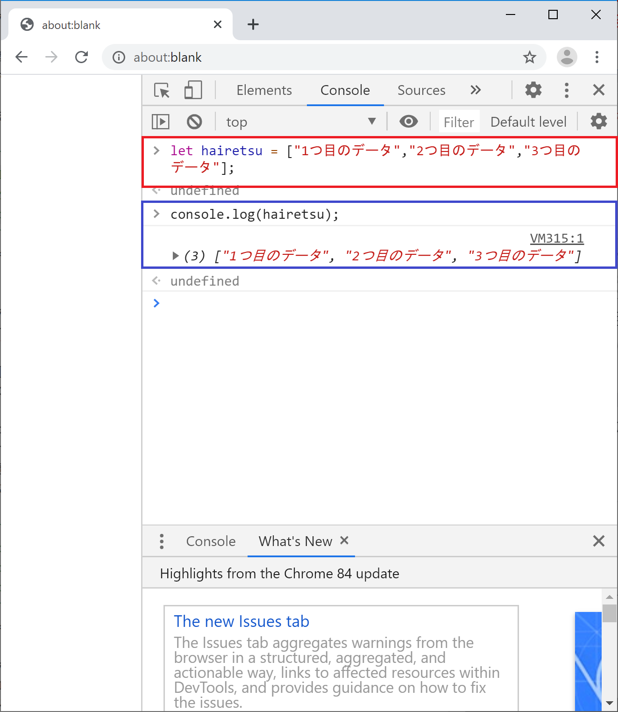
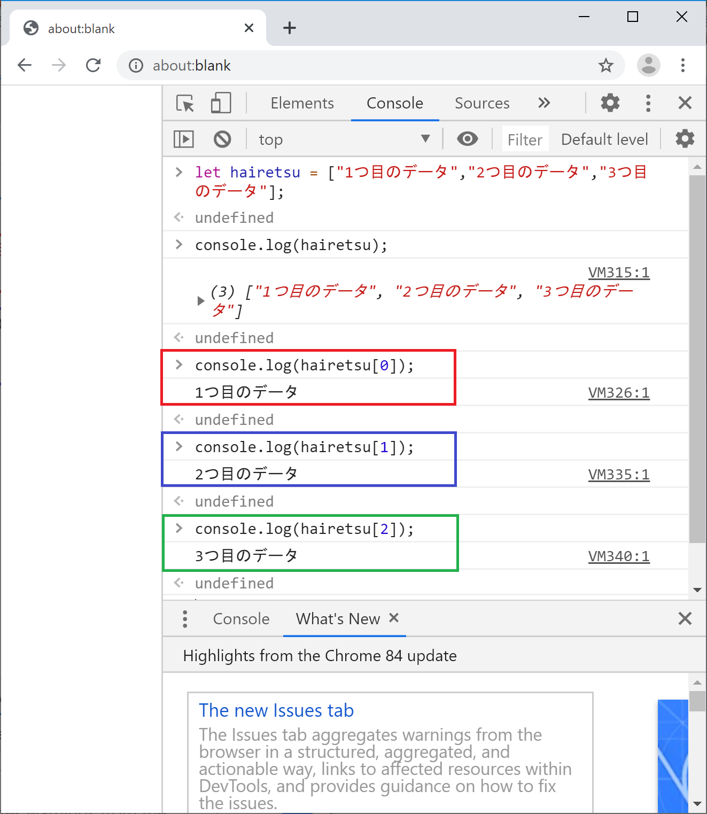
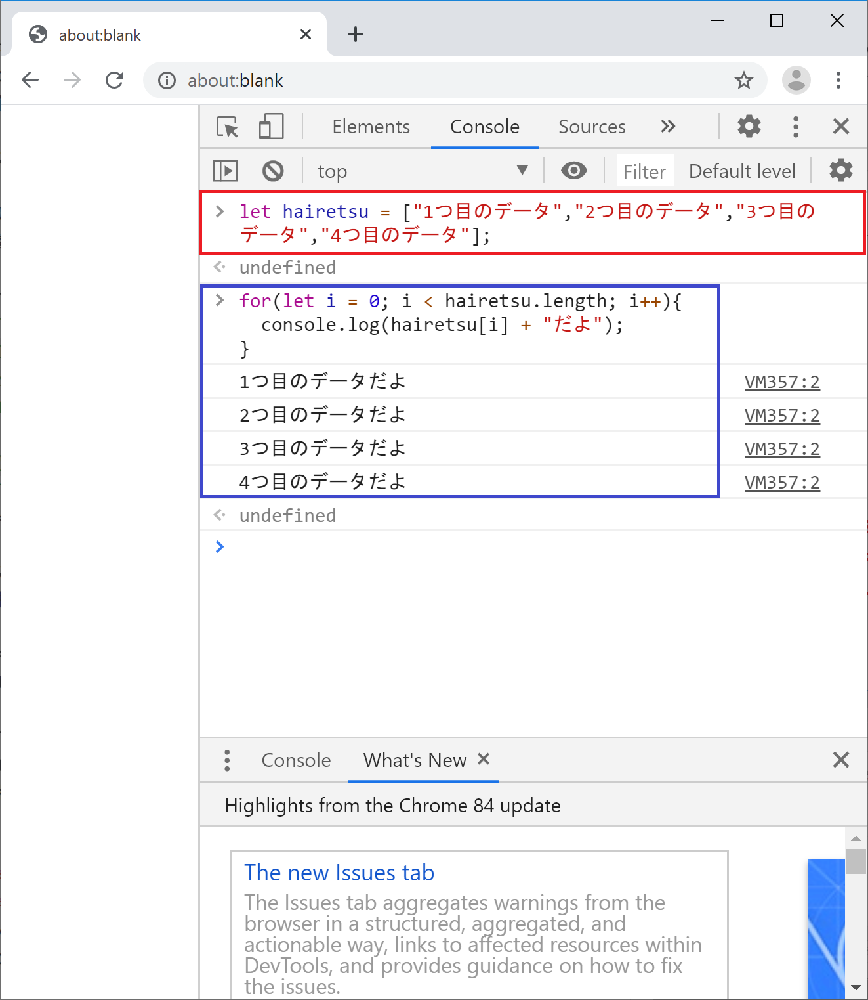
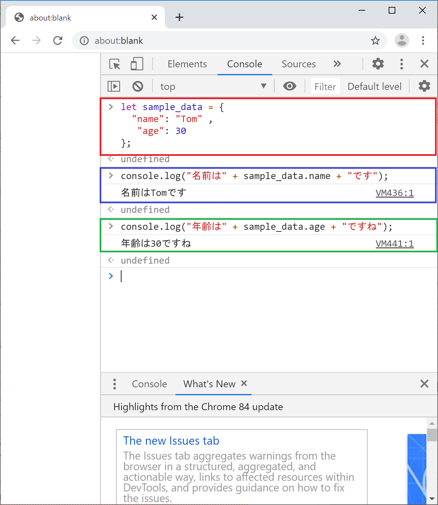
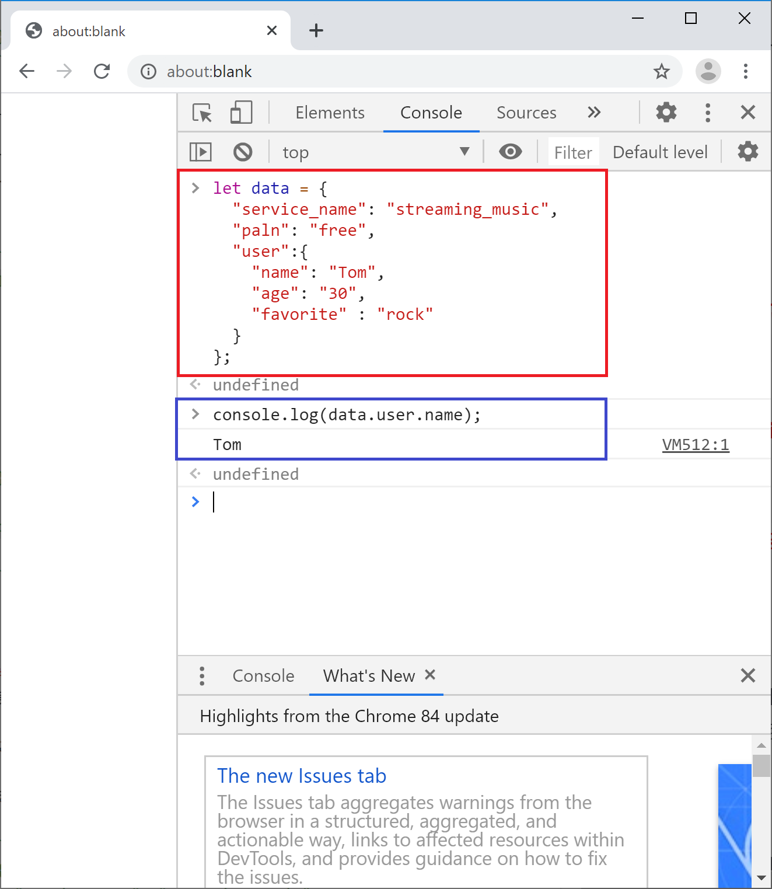
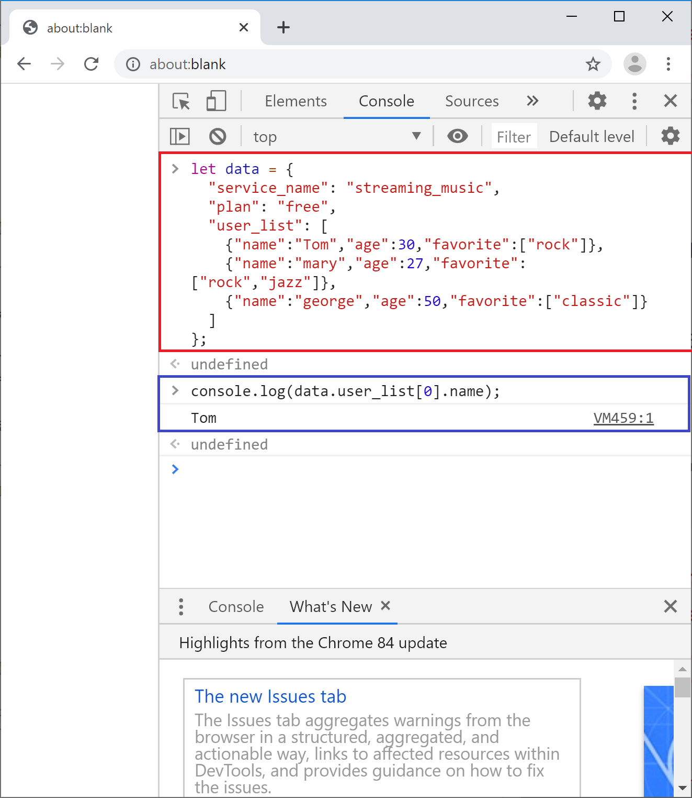
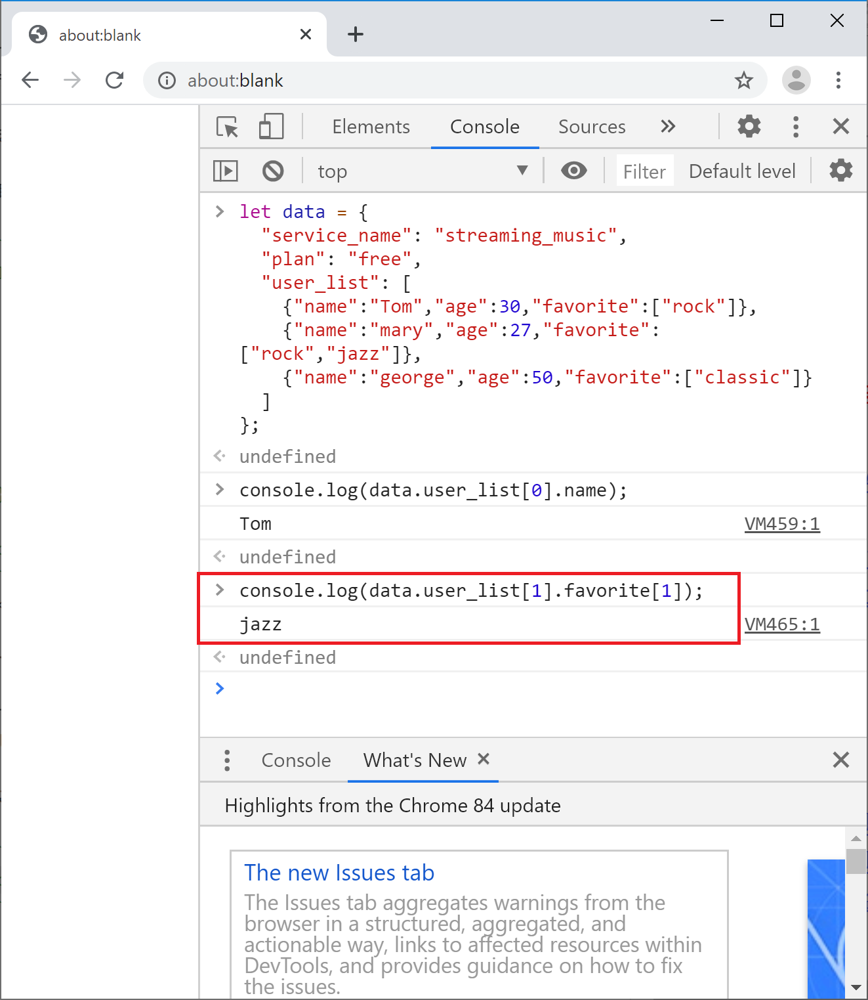

## データ構造について
前のページまででJavaScriptの基本的な書き方を学ぶことができました。

続いてデータ構造についてお話をします。

ここではWeb APIを扱う際によく登場する2つのデータ構造のお話をします。

- 配列について
- JSONについて


### 配列について
配列自体はそこまで難しい考え方ではないので、簡単に説明をしておきます。

まずは配列を体験してみましょう。

```
let hairetsu = ["1つ目のデータ","2つ目のデータ","3つ目のデータ"];
console.log(hairetsu);
```



ポイントは1行目で変数にデータを格納する際に、[]で囲んでいるところです。

[]の中にカンマ区切りでデータを入力することで、1つの変数の中に複数のデータをまとめて登録することができます。これが配列です。

コンソール画面の出力を見ると右向きの三角があるのでそこをクリックしてみてください。
登録したデータに番号が振られて保存されているのが分かると思います。
この番号を使って、登録したデータを個別に取り出すことができます。

```
console.log(hairetsu[0]);
console.log(hairetsu[1]);
console.log(hairetsu[2]);
```


ポイントは配列の登録が0始まりになっているということです。
1つ目の番号にアクセスする場合は0を指定、2つ目のデータにアクセスする場合は1を指定という風になっています。
コンピュータの処理上の問題なので、そういうものだと思って覚えてください。

これが配列の基本的な扱い方です。


ちなみに上記では配列に登録されているデータ数が3つだと分かっていたので手書きしましたが、登録されているデータが1つかもしれないし10000個かもしれない場合にどうすればいいのかという問題があります。

これも簡単に処理することが可能です。
「配列.lengh」という風にプログラムを書くと、配列の長さ（登録されているデータ数）が取得できまます。
数が分かってしまえば、あとはforループで処理が可能です。

サンプルコードは以下の通りです。
```
let hairetsu = ["1つ目のデータ","2つ目のデータ","3つ目のデータ","4つ目のデータ"];
for(let i = 0; i < hairetsu.length; i++){
  console.log(hairetsu[i] + "だよ");
}
```


このように配列はfor文など他の文法と組合わせて使うことで強い力を発揮することができます。

今回はWeb APIのレスポンスを処理することが目的なので、配列の説明は以上です。

プログラミングの中で配列をどのように活用していくかはいろいろなアプローチがあるので、いろいろ調べたりコードを書いてみたりしてくださいね。


### JSONについて
#### データフォーマットについて
Web APIを扱うにあたって、データフォーマットとして押さえておきたいのがJSONです。

データフォーマットというのは、コンピュータ上でデータを扱うときのルールのことです。

例えばCSVであれば、それぞれの値をカンマで区切るというルールで作成します。

XMLであれば「<xxx>データ</xxx>」という風にデータをタグで囲むというルールでデータを作成します。

特定のアプリケーションでしか使われないフォーマットもあれば、一般的な形式として様々なアプリケーションで使われているフォーマットもあります。


いろいろなアプリケーションで共通のデータフォーマットが使われるメリットを考えてみましょう。

例えばシステムAからシステムBにデータを渡したいという場合を考えてみましょう。

もしデータフォーマットが違う場合はシステムAのデータフォーマットからシステムBのデータフォーマットに変換するプログラムを作成する必要があります。

システムAとシステムBの2つだけであればどうにかなるかもしれませんが、ではシステムが100種類あったらどうでしょう？
データフォーマット変換プログラムの数がものすごい数になってしまいますね。

この問題を解決するのが共通のデータフォーマットになります。
システム間で同じデータフォーマットが使えれば、データをそのまま渡して読み込んでもらうことができます。

JSONもこうしたデータフォーマットのひとつで、様々なアプリケーションで利用されています。


#### JSONのフォーマット
前置きが長くなりましたが、それでは本題のJSONです。

JSONはJavaScript Object Notationの略で、JavaScriptで使われていたデータフォーマットが広まったものです。

CSVがカンマ区切りでデータを記述するように、JSONも決まったルールでデータを記述します。

それではJSONのフォーマットを見てみましょう。
まずは基本系からです。

```
{ "name": "Tom" , "age": 30 }
```

JSONは外側を{}で囲み、中にデータを入力します。
データを入力する際はキー名と値をセットにしてコロンで区切って入力します。
※キー名は項目名くらいに思っておいてもらえれば大丈夫です。

キー名はダブルクオーテーションで囲みます。

値については文字列の場合はダブルクオーテーションで囲みますが、数値型など文字列として扱いたくない場合はダブルクオーテーションなしで書きます。

複数のキー名と値を扱いたい場合は、カンマで区切って入力します。
最後のキー名と値の後ろにはカンマは入らないので注意です。


データ量が増えると見難くなるので、以下のように改行とインデントを入れて見やすくすることが多いです。

```
{
  "name": "Tom" ,
   "age": 30
}
```


#### JavaScriptでJSONを扱ってみよう
JSONにすると何がいいの？っていう素朴な疑問が出てくると思いますので、疑問解消のためにJavaScriptでJSONを扱ってみましょう。


まずは簡単なJSONからはじめます。
コードは以下の通りです。

```
let sample_data = {
  "name": "Tom" ,
   "age": 30
};

console.log("名前は" + sample_data.name + "です");
console.log("年齢は" + sample_data.age + "ですね");
```



まず最初に変数sample_dataにJSONデータを格納しています。

その後にconsole.log()でコンソール画面にJSONに格納したデータを表示しています。
その際に変数名.キー名という形でデータにアクセスできているのが分かるでしょうか。

このように変数名はキー名といった人間に分かりやすい情報を使ってデータにアクセスできるところが、JSONのメリットと言えます。

しんどいのでサンプルコードは書かないですが、これを単純な文字列の処理としてやろうとするとざっくり下のような流れになります・・・
1. 最初のnameまでの文字数を変え添える
2. nameの後ろに":"があるので、1の文字数から数えて4つ目が名前が始まる場所だと分かる。
3. 次に"が出てくる場所の文字数が最初から何文字目かを判定し、その1つ前までが名前が入力されている場所だと判断する
4. 2と3の範囲で文字を抜き出すと名前が取得できる


JSONの便利さが少しイメージできたでしょうか？


### JSONをネストする
ネストとは入れ子構造のことです。
マトリョーシカのように、あるものの中に同じ構造のものが入っていることをネスト（入れ子）と言います。

ここではJSONの中にJSONを入れることを指しています。

ネストされたJSONのデータ構造の例は以下のようになります。

```
{
  "service_name": "streaming_music",
  "paln": "free",
  "user":{
    "name": "Tom",
    "age": "30",
    "favorite" : "rock"
  }
}
```

userというキーに対応する値にJSONが入っているのが分かると思います。

ではこのデータ構造を元にTomの好きな音楽ジャンルを取得してみましょう。


```
let data = {
  "service_name": "streaming_music",
  "paln": "free",
  "user":{
    "name": "Tom",
    "age": "30",
    "favorite" : "rock"
  }
};

console.log(data.user.name);
```


このようにネストされている場合でも「.（ドット）」でキーを繋いでいけば値を取得可能となっています。


#### 複雑なJSONの例
実際にWeb APIを扱う場合は、もう少し複雑なJSONを扱います。

こちらも具体的な例を見ておきましょう。

まずは扱うJSONから。

```
{
  "service_name": "streaming_music",
  "plan": "free",
  "user_list": [
    {"name":"Tom","age":30,"favorite":["rock"]},
    {"name":"mary","age":27,"favorite":["rock","jazz"]},
    {"name":"george","age":50,"favorite":["classic"]}
  ]
}

```

ポイントはJSONの値に配列が入っているところです。

ではこのJSONデータをdataという名前の変数に格納して、データの取得にチャレンジしてみましょう。

まずはTomの名前を取得してみましょう。

自分で考えてみてから下の答えを見てください。

```
let data = {
  "service_name": "streaming_music",
  "plan": "free",
  "user_list": [
    {"name":"Tom","age":30,"favorite":["rock"]},
    {"name":"mary","age":27,"favorite":["rock","jazz"]},
    {"name":"george","age":50,"favorite":["classic"]}
  ]
};

console.log(data.user_list[0].name);
```


うまく取得できましたか？

では続いてmaryの好きなものに入っている「jazz」という文字を取り出してみましょう。

こちらも自分で考えてみてから下の答えを見てくださいね。

```
console.log(data.user_list[1].favorite[1]);
```



うまく取得できたでしょうか？

Web APIを使ってシステム連携を行う際は、このようにJSONと配列を組み合わせてデータを扱っていくことになります。


## まとめ
ここでは基本的なデータ構造を学びました。

予定よりもずいぶんと長くなってしまいましたがなんとか終わりました。
お疲れさまでした。

Web APIを叩いてデータを取得するだけであればそれほど気にしなくても大丈夫ですが、データ構造は非常に重要です。

なぜならデータ構造によって処理の効率が大きく変わるからです。

Web APIから取得したデータを変数の中に一時保存して処理する場合でも、次の処理が行いやすい形式に変換して保存するなど工夫が必要になったりします。

もしプログラミングのトレーニングを継続してスキルを上げていくのであれば、データ構造も意識してみてください。


[< 関数](./index7.html) | [Web APIを叩いてみよう 実践編>](./index9.html)

<hr>

[0.JavaScriptについて](./index.html)
[1.ブラウザのConsole画面の使い方](./index2.html)
[2.変数の基本](./index3.html)
[3.順次処理](./index4.html)
[4.分岐処理](./index5.html)
[5.反復処理](./index6.html)
[6.関数](./index7.html)
[7.データ構造について](./index8.html)
[8.Web APIを叩いてみよう](./index9.html)
[9.HTMLと組み合わせて使ってみよう](./index10.html)
