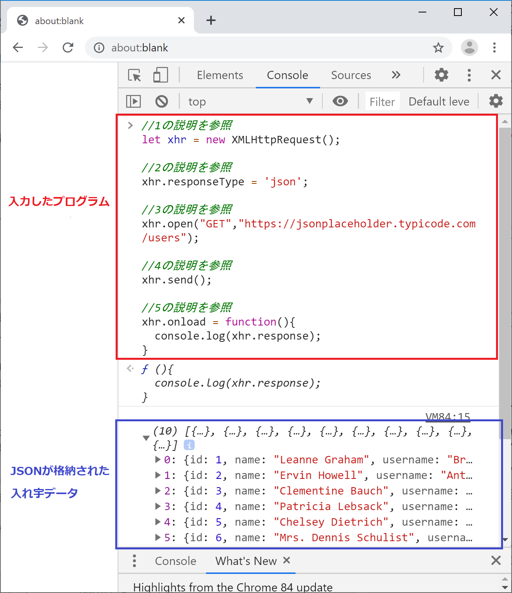
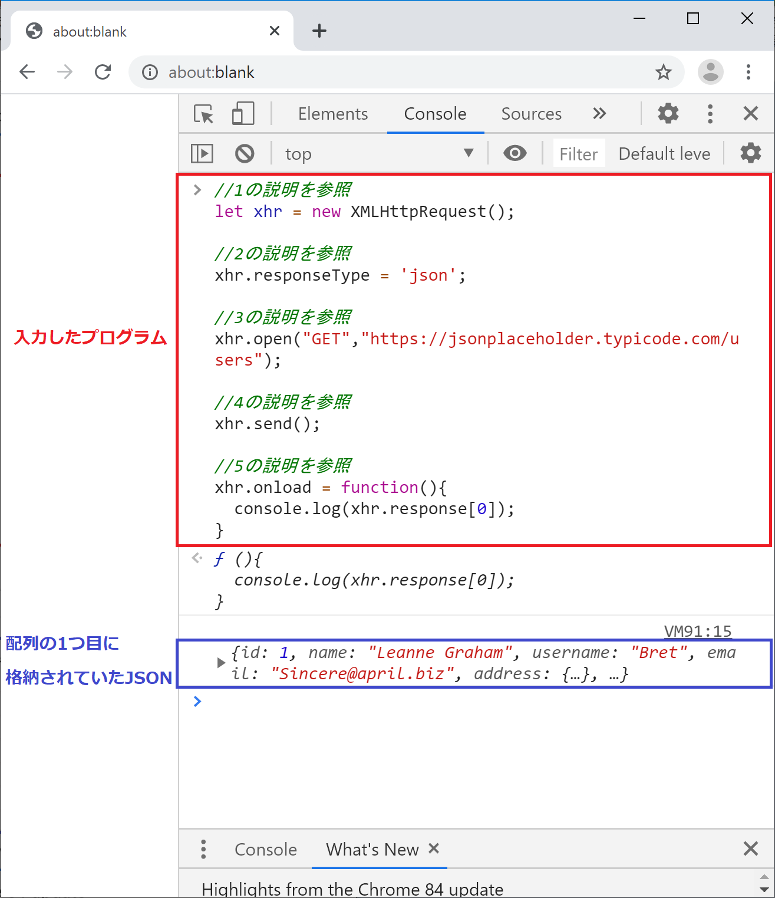
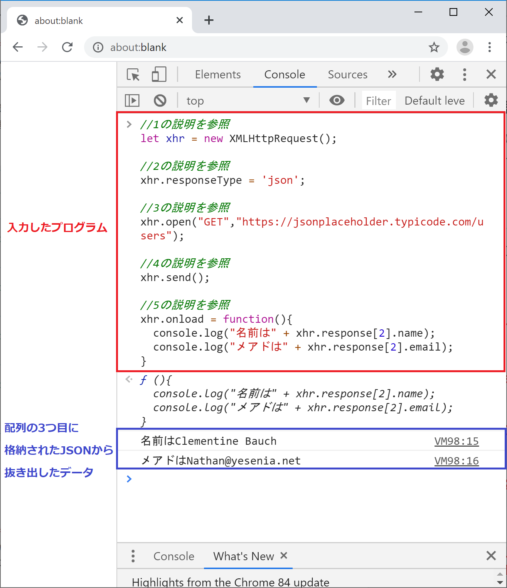

## Web APIを叩いてみよう 実践編
JavaScriptの書き方を学び、Web APIを扱うために必要なデータ構造を学びました。

次はお待ちかねのWeb APIを叩いてみる編です！


### APIとは
まずAPIとは何かを考えてみます。

まずAPIという言葉です。
APIはApplication Programming Interfaceの略です。
英語で見るとなんだか難しそうですね・・・

APIをざっくり説明すると以下となります。
- とある機能を持ったプログラムAがあります。
- プログラムAは自分の機能を公開して、他のプログラムにも使わせてあげることにしました。
- プログラムAは自分の機能を使う場合の手順とデータフォーマットを決めました。これがAPIです。
- APIに対して処理してほしいデータを渡すと、処理結果を戻してくれます。

これ、どこかで見たものに似てませんか？

関数の仕組みとそっくりですよね。
引数と戻り値もあります。

実はAPIも関数の一種と考えることができます。


### Web APIとは
次にWeb APIです。

APIを呼び出す場合、実はいろいろな手順やデータフォーマットがあります。
その中でもWeb技術を利用するタイプのAPIをWeb APIと呼んでいます。

Web APIでは通信の仕組みとしてHTTPを使い、データフォーマットではXMLやJSONを使うことが多いです。

したがってアクセスの際にはURLを利用します。
データの渡し方はHTTPメソッドを使います。

通常、Web APIにはReferenceがありますので
実際にWeb APIを使う場合はReferenceを参照しながら
URL、データフォーマット、HTTPメソッドを選んでください。


#### HTTPメソッドとCRUD
JavaScript入門から離れてしまうので深追いしませんが、
Web APIでよく使われるHTTPメソッドはGET/POST/PUT/DELETEの4つです。

これはデータベースの基本処理であるCRUD（クラッド）と呼ばれる考え方に基づいています。
CRUDはCreate（作成）/Read（読み込み）/Update（更新）/Delete（削除）です。

基本的には以下のイメージで使われますが、
そもそもHTTPメソッドとCRUDは別ものなので完全に一致した使われ方にはなっていないのが現状です。
- GET - Read
- POST - Create
- PUT - Update
- DELETE - Delete

HTTPメソッドやCRUDについて詳しく知りたい人はググって見てください。


今回はGETを使ったサンプルのみを扱います。


#### HTTPでGETメソッドを扱う場合の基本的な流れ
HTTP通信は以下の流れで進みます。
   1. HTTPのリクエスト用のデータを作る
   2. HTTPリクエストを送信する
   3. HTTPレスポンスが返ってきたら、それを受け取って処理する

この3つについてJavaScriptでコードを書いていくことになります。


### 今回利用するWeb APIについて
今回はJSON Placeholderというサイトを利用します。

[JSON Placeholder](https://jsonplaceholder.typicode.com/)

このサイトは開発者向けにテスト用のWeb APIを公開してくれているサイトです。
いくつかのWeb APIが用意されていて、アクセスするとダミーのJSONデータを返してくれます。

様々なサービスでWeb APIが公開されていますが、それらを利用するためには申し込み手続きを行い、JavaScriptで認証を行うためのプログラム開発が必要になります。

それらは今回のテーマから大きく逸脱してしまうので、今回は無料で使えるJSON Placeholderを使うことにしました。


### データ構造を確認しておこう
まずはブラウザでアクセスして、どんなJSONデータが返ってくるのかを確認しておきましょう。

次のリンクをブラウザで開いてください。
[ダミーのユーザーデータ](https://jsonplaceholder.typicode.com/users)

今回のデータは全体が配列になっていて、中に複数のJSONが格納されています。

構造としては以下のような形です。
```
[{1つ目のJSON},{2つ目のJSON},{3つ目のJSON},...]
```

一応キャプチャも貼っておきます。


### JavaScriptでWeb APIを叩いてデータを取得しよう
それではこのWeb APIをJavaScriptで叩いてJSONデータを取得してみましょう。

Web APIを叩くためにはJavaScriptでHTTP通信をおこなう必要があります。

JavaScriptでのHTTP通信については最近ではfetchという機能を使うことが多いですが、今回は処理の流れを理解しやすいXMLHttpRequestという機能で説明をしていこうと思います。

#### まずは受け取ったJSONをそのまま表示
まずは受け取ったJSONをそのままコンソール画面に表示します。

流れを意識してコードを読んでください。

```
//1の説明を参照
let xhr = new XMLHttpRequest();

//2の説明を参照
xhr.responseType = 'json';

//3の説明を参照
xhr.open("GET","https://jsonplaceholder.typicode.com/users");

//4の説明を参照
xhr.send();

//5の説明を参照
xhr.onload = function(){
  console.log(xhr.response);
}

```


1. XMLHttpRequestという機能を呼び出してxhrという名前で扱えるようにしています。

2. 利用するWeb APIに合わせてHTTPレスポンスで返ってくるデータのフォーマットを設定しています。

3. xhrという名前で扱えるようにしたXMLHttpRequestに対して、GETメソッドを使ってURLを開くという設定を行います。

4. xhrという名前で扱えるようにしたXMLHttpRequestでリクエストを送信します。

5. HTTPレスポンスを受け取った後に行う処理を各部分です。ここではxhr.responseという名前で格納されているので、それをそのままコンソール画面に表示しています。


#### 配列の1つ目に入っているJSONだけを抜き出して表示する
APIを叩いてJSONデータを受け取るまでの流れは同じで、受け取った後の処理だけを変えてみます。

受け取ったデータは配列に格納されているので、1つ目だけをコンソール画面に表示してみます。

```
//1の説明を参照
let xhr = new XMLHttpRequest();

//2の説明を参照
xhr.responseType = 'json';

//3の説明を参照
xhr.open("GET","https://jsonplaceholder.typicode.com/users");

//4の説明を参照
xhr.send();

//5の説明を参照
xhr.onload = function(){
  console.log(xhr.response[0]);
}
```



#### 配列の3つ目に入っているJSONのnameとemailだけを抜き出して表示する

前の章でJSONの扱いをしっかり学んでいるので、これも簡単ですね。

1つ前のサンプルと同じくAPIを叩いてJSONデータを受け取るまでの流れは変わりません。

受け取ったデータから必要なデータだけをうまく抜き出して表示してみましょう。

#### 配列の1つ目に入っているJSONだけを抜き出して表示する
APIを叩いてJSONデータを受け取るまでの流れは同じで、受け取った後の処理だけを変えてみます。

受け取ったデータは配列に格納されているので、1つ目だけをコンソール画面に表示してみます。

```
//1の説明を参照
let xhr = new XMLHttpRequest();

//2の説明を参照
xhr.responseType = 'json';

//3の説明を参照
xhr.open("GET","https://jsonplaceholder.typicode.com/users");

//4の説明を参照
xhr.send();

//5の説明を参照
xhr.onload = function(){
  console.log("名前は" + xhr.response[2].name);
  console.log("メアドは" + xhr.response[2].email);
}
```



## まとめ
web APIを叩いてデータを受け取り、必要なデータにアクセスする方法について理解できたでしょうか？

次が最後の章です。

受け取ったデータから必要な項目を抜き出して、HTMLで表示するまでをやってみます。


[< データ構造について](./index8.html) | [HTMLと組み合わせて使ってみよう >](./index10.html)

<hr>

[0.JavaScriptについて](./index.html)
[1.ブラウザのConsole画面の使い方](./index2.html)
[2.変数の基本](./index3.html)
[3.順次処理](./index4.html)
[4.分岐処理](./index5.html)
[5.反復処理](./index6.html)
[6.関数](./index7.html)
[7.データ構造について](./index8.html)
[8.Web APIを叩いてみよう](./index9.html)
[9.HTMLと組み合わせて使ってみよう](./index10.html)
