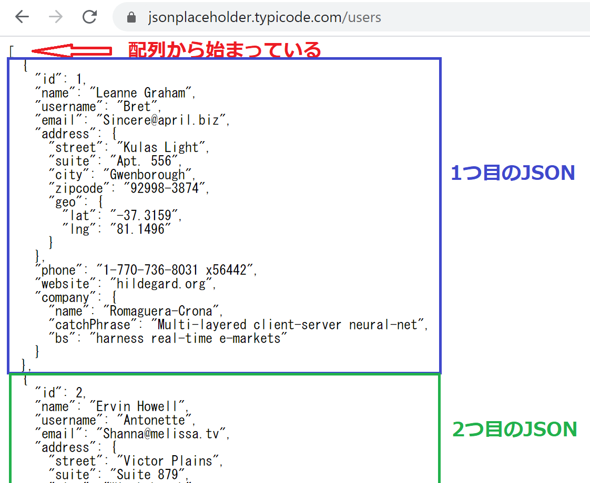

## Web APIを叩いてみよう 実践編
JavaScriptの書き方を学び、Web APIを扱うために必要なデータ構造を学びました。

次はお待ちかねのWeb APIを叩いてみる編です！


### 今回利用するWeb APIについて
今回はJSON Placeholderというサイトを利用します。

[JSON Placeholder](https://jsonplaceholder.typicode.com/)

このサイトは開発者向けにテスト用のWeb APIを公開してくれているサイトです。
いくつかのWeb APIが用意されていて、アクセスするとダミーのJSONデータを返してくれます。

様々なサービスでWeb APIが公開されていますが、それらを利用するためには申し込み手続きを行い、JavaScriptで認証を行うためのプログラム開発が必要になります。

それらは今回のテーマから大きく逸脱してしまうので、今回は無料で使えるJSON Placeholderを使うことにしました。


### データ構造を確認しておこう
まずはブラウザでアクセスして、どんなJSONデータが返ってくるのかを確認しておきましょう。


[ダミーのユーザーデータ](https://jsonplaceholder.typicode.com/users)

今回のデータは全体が配列になっていて、中に複数のJSONが格納されています。

構造としては以下のような形です。
```
[{1つ目のJSON},{2つ目のJSON},{3つ目のJSON},...]
```

一応キャプチャも貼っておきます。




### JavaScriptでWeb APIを叩いてデータを取得しよう


## まとめ


[< Web APIを叩いてみよう 前置き編](./index8.html) | [HTMLと組み合わせて使ってみよう >](./index10.html)


[0.JavaScriptについて](./index.html)
[1.ブラウザのConsole画面の使い方](./index2.html)
[2.変数の基本](./index3.html)
[3.順次処理](./index4.html)
[4.分岐処理](./index5.html)
[5.反復処理](./index6.html)
[6.関数](./index7.html)
[7.Web APIを叩いてみよう　前置き編](./index8.html)
[8.Web APIを叩いてみよう　実践編](./index9.html)
[9.HTMLと組み合わせて使ってみよう](./index10.html)
